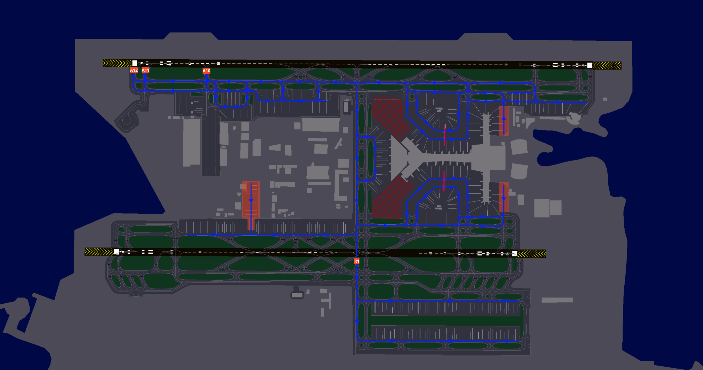
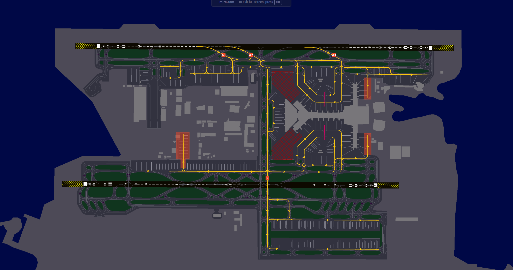
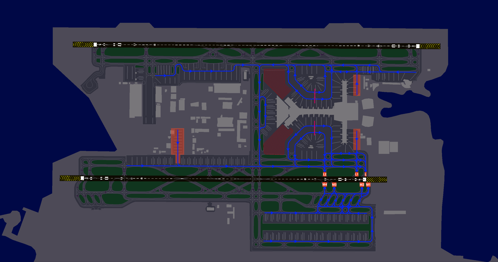
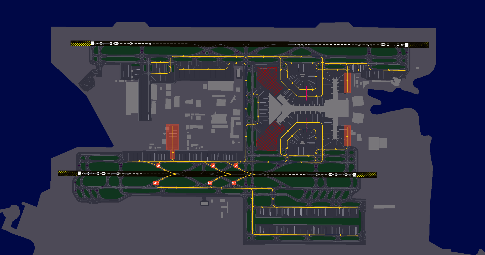
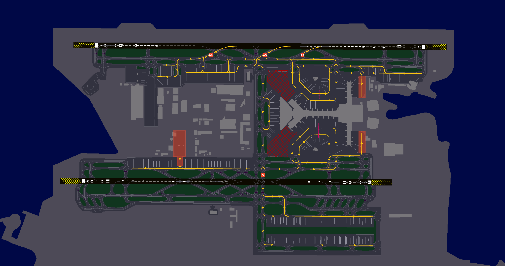

# 7. Appendix - Taxi Diagrams
## 7.1 Use of Diagrams
Blue lines indicate departure taxi routes. Yellow lines indicate arrival taxi routes. Runway holding points are shown in red.

Taxiways with a red background are not code F (A380/B747-8) compatible.

## 7.2 Runway 16L
### 7.2.1 Departure
<figure markdown>

</figure>

### 7.2.2 Arrivals
<figure markdown>

</figure>

## 7.3 Runway 16R
### 7.3.1 Departure
<figure markdown>

</figure>

### 7.3.2 Arrivals
<figure markdown>

</figure>

## 7.4 Runway 34L
### 7.4.1 Departure
<figure markdown>

</figure>

### 7.4.2 Arrivals
<figure markdown>

</figure>

## 7.5 Runway 34R
### 7.5.1 Departure
<figure markdown>

</figure>

### 7.5.2 Arrivals
<figure markdown>

</figure>