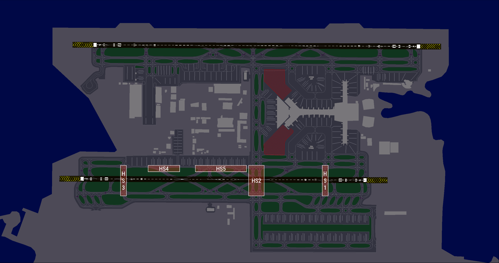

# 6. Aerodrome Incursion Hotspots
## 6.1 General guidance
Due to the complex layout of the aerodrome, several areas exist which are prone to taxiway/runway incursions. Controllers must exercise caution and remain vigilant when aircraft are operating in these areas. The diagram below shows the hotspots within Hamad.

## 6.2 General Hotspots
<figure markdown>

</figure>

## 6.3 Hotspot 1, 2, and 3
There is an increased risk of runway incursions due to traffic flow. Pilots must exercise caution when approaching runway holding points and ensure they receive clearance before entering or crossing any runway. Pilots should remain vigilant of hold short positions, parking areas, signage, and stopbars.

## 6.4 Hotspot 4 and 5
Due to the complex taxiway layout, pilots should exercise caution when exiting the runway, especially with traffic pushing back from Apron 5.