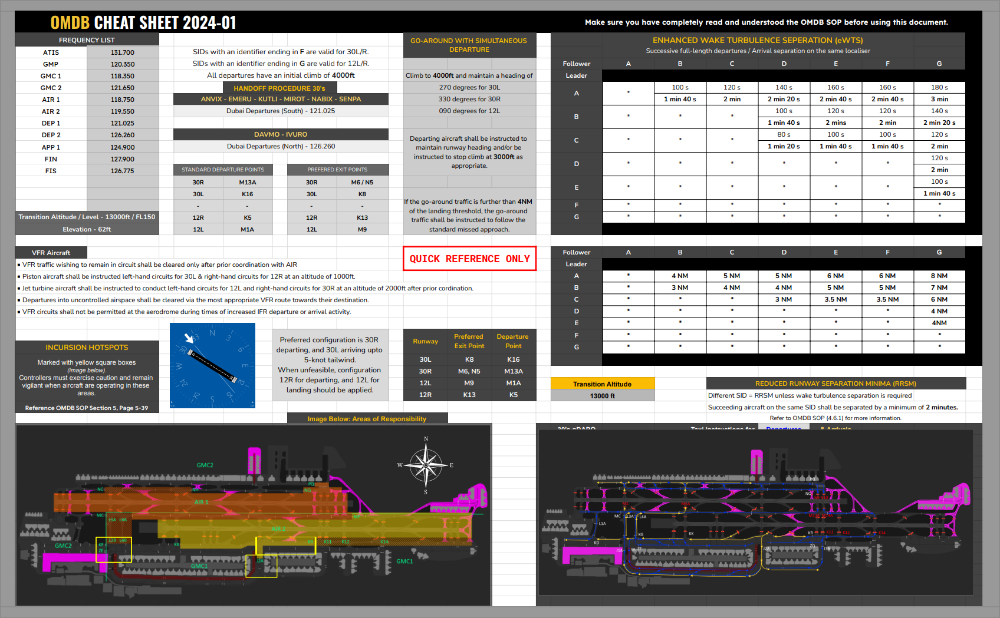

# 8. Appendix - Aerodrome quick reference sheet
## 8.1 Use of Diagrams
The Quick Reference Sheet should only be used once all the aerodrome SOP's have been read and understood.

## 8.2 Quick reference
<figure markdown>

</figure>
