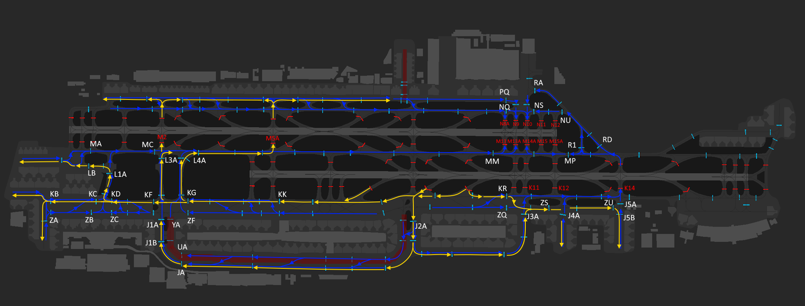
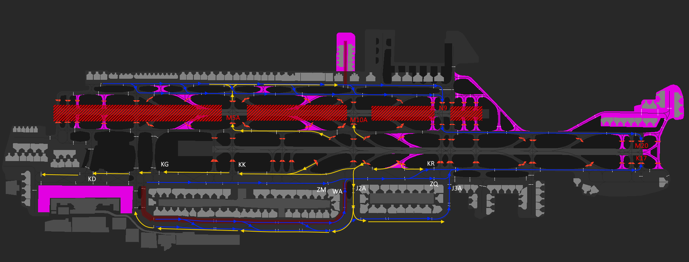
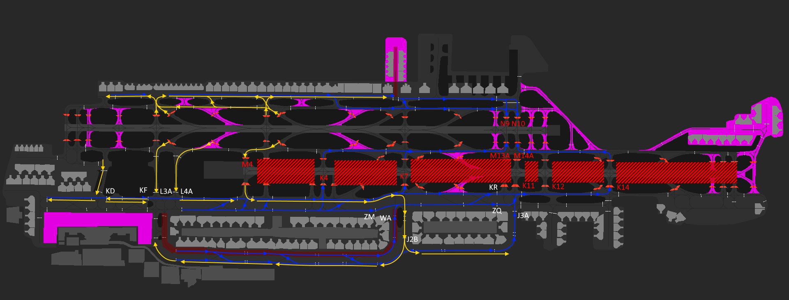
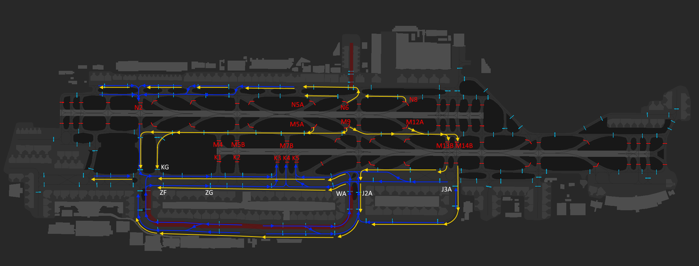
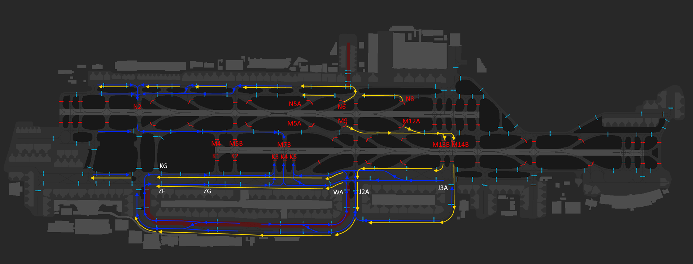
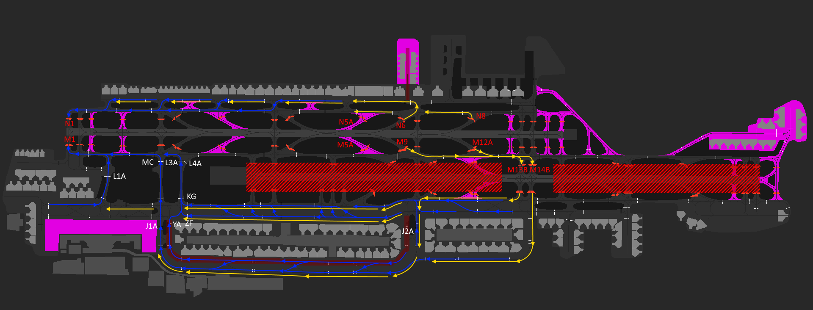

# 6. Appendix - Taxi Diagrams
## 6.1 Use of Diagrams
Blue lines indicate departure taxi routes. Yellow lines indicate arrival taxi routes.

Commonly used intermediate holding points are shown in white. Runway holding points are shown in red.

Pink indicates areas not available in some sceneries and shall not be used unless requested.

Taxiways with a red background are not code F (A380/B747-8) compatible.

## 6.2 Runway 30 configuration
### 6.2.1 Dual Runway 30L/30R
<figure markdown>

</figure>
<figure markdown>
  <figcaption>Figure6-1: Taxi routings - 30 dual config</figcaption>
</figure>

### 6.2.2 Single Runway 30L
<figure markdown>

</figure>
<figure markdown>
  <figcaption>Figure6-2: Taxi routings - 30L single runway config</figcaption>
</figure>

### 6.2.3 Single Runway 30R
<figure markdown>

</figure>
<figure markdown>
  <figcaption>Figure6-3: Taxi routings - 30R single runway config</figcaption>
</figure>

## 6.3 Runway 12 configuration
### 6.3.1 Dual Runway 12L/12R (Arrival Bias)
<figure markdown>

</figure>
<figure markdown>
  <figcaption>Figure6-4: Taxi routings - 12 dual arrival bias config (Click to expand)</figcaption>
</figure>

### 6.3.2 Dual Runway 12L/12R (Departure Bias)
<figure markdown>

</figure>
<figure markdown>
  <figcaption>Figure6-5: Taxi routings - 12 dual departure bias config (Click to expand)</figcaption>
</figure>

### 6.3.3 Single Runway 12L
<figure markdown>

</figure>
<figure markdown>
  <figcaption>Figure6-6: Taxi routings - 12L single runway config</figcaption>
</figure>

### 6.3.4 Single Runway 12R
<figure markdown>

</figure>
<figure markdown>
  <figcaption>Figure6-7: Taxi routings - 12R single runway config</figcaption>
</figure>