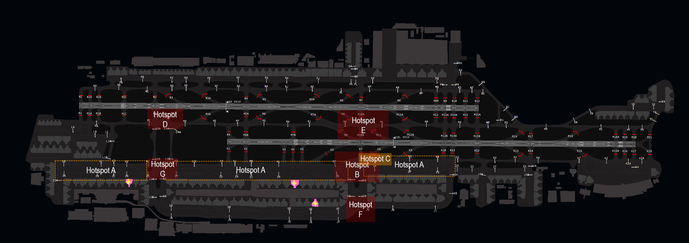

# 6. Aerodrome Incursion Hotspots
## 6.1 General guidance
Due to the complex layout of the aerodrome, several areas exist which are prone to taxiway/runway incursions. Controllers must exercise caution and remain vigilant when aircraft are operating in these areas. The diagram below displays critical areas in Dubai

## 6.2 Hotspot A
Area with a history of taxiway incursions during pushback due to confusion between taxiway Z and taxiway K. 

Controllers shall ensure that aircraft correctly read back the facing instruction as well as the taxiway designator when issuing pushback clearance. Close monitoring of the pushback is also required to ensure aircraft do not inadvertently enter taxiway K.

## 6.3 Hotspot B
Area with a history of taxiway incursions due to confusion between intersecting taxiways Z, K, W and J2.

Controllers shall pay close attention to aircraft taxiing in this area, particularly when taxiing northbound on W and J2 and when aircraft are vacating the runway to turn left onto J2. Appropriate use of the words “LEFT” and “RIGHT” to avoid confusion and/or ambiguity is recommended.

## 6.4 Hotspot C
Area prone to taxiway incursions due to aircraft missing intermediate holding point KP when taxiing westbound on K after vacating runway 30L.

Plain language instructions may be required to hold traffic short of K8 to avoid blocking the runway exit.

## 6.5 Hotspot D
Area with a history of runway incursions dure to aircraft confusing taxiway M1 and M2 with taxiway L3 and L4.

## 6.6 Hotspot E
Area prone to runway incursions by traffic vacating runway 12L via taxiway M9 and turning right onto taxiway M10B or taxiway M11 and entering runway 12R.

Controllers shall ensure that traffic correctly read back the initial taxi instruction which shall include the words “TURN LEFT ONTO M” to avoid ambiguity.

## 6.7 Hotspot F
Area prone to taxiway incursion due to confusion between locations of apron D and apron B.

Controllers shall include the word “LEFT” or “RIGHT” when instructing aircraft to join taxiway J.

## 6.8 Hotspot G
Area with a history of taxiway incursions due to confusion between intersecting taxiways Z, K, Y and J1.

Controllers shall pay close attention to aircraft taxiing in this area and include explicit instructions to taxi via each taxiway.

## 6.9 Hotspots Diagram
<figure markdown>

</figure>
<figure markdown>
  <figcaption>Figure 6-1: Dubai Hotspots </figcaption>
</figure>