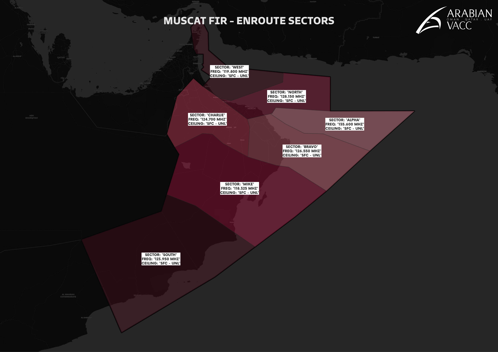

# 6. Sector Specific
<figure markdown>

</figure>

## 6.1 Sector A
### 6.1.1 Radar & Radio Limitations
Sector A covers traffic entering or exiting the Muscat FIR via PARAR and RASKI. This sector transitions progressively from a fully radar-controlled environment (PSR coverage up to 100 NM; MSSR up to 256 NM) to a procedural sector near the FIR boundary, where radar and radio coverage degrade significantly.

### 6.1.2 Typical Traffic Flows & Conflicts
Sector A handles arrivals into the Muscat TMA from the east and manages traffic transiting towards procedural airspace such as Mumbai Oceanic. Controllers must monitor traffic sequencing carefully as aircraft lose radar coverage.

### 6.1.3 Coordination Requirements
Controllers shall maintain longitudinal separation minima as per Section 2.2.2.2 when coordinating with procedural FIRs. Special attention is needed near the FIR boundary due to reduced surveillance and communications.

## 6.2 Sector B
### 6.2.1 Radar & Radio Limitations
Sector B manages traffic via REXOD and TOTOX, with similar radar coverage to Sector A: PSR up to 100 NM, MSSR up to 256 NM, with degradation near the FIR boundary.

### 6.2.2 Typical Traffic Flows & Conflicts
This sector is responsible for arrivals into the Muscat TMA from the south-east and manages traffic moving toward procedural FIRs.

### 6.2.3 Coordination Requirements
Controllers must apply longitudinal separation minima per Section 2.2.2.2 and coordinate carefully as surveillance fades.

## 6.3 Sector C
### 6.3.1 Radar & Radio Limitations
Sector C operates fully within radar coverage and manages traffic via MEMTU, LABRI, TARDI, RETAS, and MIDGU.

### 6.3.2 Typical Traffic Flows & Conflicts
Handles outbound traffic from Abu Dhabi and Dubai TMAs and arrivals into the Muscat TMA from the west.

### 6.3.3 Coordination Requirements
Apply longitudinal separation minima per Section 2.2.2. Coordinate per UAE & Muscat LoA for adjacent FIRs.

## 6.4 Sector M
### 6.4.1 Radar & Radio Limitations
Sector M manages traffic via DAPOL, KITAL, and LOTAV, transitioning from radar to procedural control near the eastern FIR boundary. PSR coverage extends up to 100 NM, MSSR up to 256 NM.

### 6.4.2 Typical Traffic Flows & Conflicts
Traffic approaches procedural FIR boundaries such as Mumbai Oceanic. Controllers must be vigilant in applying separation minima.

### 6.4.3 Coordination Requirements
Longitudinal separation minima as per Section 2.2.2.2 apply. Coordination critical near procedural boundaries.

## 6.5 Sector N
### 6.5.1 Radar & Radio Limitations
Sector N operates fully within radar coverage, managing inbound/outbound Muscat TMA traffic and enroute flows.

### 6.5.2 Typical Traffic Flows & Conflicts
Responsible for arrivals into Muscat TMA from the north-east and acts as the bandbox sector covering the whole FIR when others are offline.

### 6.5.3 Coordination Requirements
Apply longitudinal separation minima per Section 2.2.2. Coordinate per UAE & Muscat LoA for adjacent FIRs.

## 6.6 Sector S
### 6.6.1 Radar & Radio Limitations
Sector S handles mixed radar and procedural traffic from Sanaa FIR and inbound/outbound Salalah TMA flows.

### 6.6.2 Typical Traffic Flows & Conflicts
Traffic transitions from procedural to radar control. Identification and new squawk assignments are critical.

### 6.6.3 Coordination Requirements
Apply longitudinal separation minima as per Section 2.2.2. Coordinate carefully with Sanaa FIR.

## 6.7 Sector W
### 6.7.1 Radar & Radio Limitations
Sector W manages enroute traffic via IMLOT, LALDO, TONVO and interfaces with Dubai, Ras Al-Khaimah, and Fujairah TMAs under full radar coverage.

### 6.7.2 Typical Traffic Flows & Conflicts
Handles traffic transiting or arriving into adjacent UAE TMAs.

### 6.7.3 Coordination Requirements
Apply longitudinal separation minima per Section 2.2.2. Coordinate per UAE & Muscat LoA.

## 6.8 Sector Opening Order
The Muscat FIR shall operate with the bandbox sector OOMM_1_CTR open at all times during ATC operations.

No additional sectors shall be activated unless explicit authorization is granted by the Arabian vACC staff team.

This policy ensures consistent coordination, efficient traffic handling, and proper airspace coverage. Any deviation from this configuration requires prior approval from the relevant vACC staff authority.

## 6.9 Sector Top-down Coverage
When the lower sector is offline, in addition to the designated areas of responsbility, top-down sector coverage shall be as follows:

<table><thead>
  <tr>
    <th>Online Sector</th>
    <th>Offline Sector</th>
    <th>Top-down Coverage</th>
  </tr></thead>
<tbody>
  <tr>
    <td rowspan="3">OOMM_1_CTR (Bandbox)</td>
    <td>OOMS_APP</td>
    <td>Muscat TMA</td>
  </tr>
  <tr>
    <td>OOSA_APP</td>
    <td>Salalah TMA</td>
  </tr>
    <tr>
    <td>OOXX_I_TWR</td>
    <td>Any FIS Aerodrome</td>
  </tr>
  <tr>
    <td>OOMM_1_CTR (Sector N)</td>
    <td>OOMS_APP</td>
    <td>Muscat TMA</td>
  </tr>
    <tr>
    <td rowspan="2">OOMM_4_CTR (Sector M)</td>
    <td>OOFD_I_TWR</td>
    <td>Fahud FIS</td>
  </tr>
  <tr>
    <td>OODQ_I_TWR</td>
    <td>Duqm FIS</td>
  </tr>
  <tr>
    <td rowspan="4">OOMM_5_CTR (Sector S)</td>
    <td>OOSA_APP</td>
    <td>Salalah TMA</td>
  </tr>
  <tr>
    <td>OOMK_I_TWR</td>
    <td>Mukhaizna FIS</td>
  </tr>
  <tr>
    <td>OOMX_I_TWR</td>
    <td>Marmul FIS</td>
  </tr>
  <tr>
    <td>OOJA_R_TWR</td>
    <td>Ja'aluni Radio</td>
  </tr>
  <tr>
    <td>OOMM_7_CTR (Sector W)</td>
    <td>OOSH_I_TWR</td>
    <td>Suhar FIS</td>
  </tr>
</tbody></table>