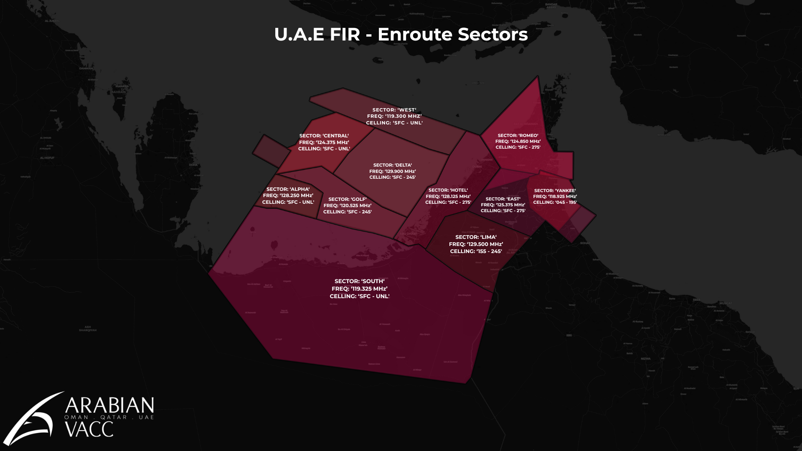
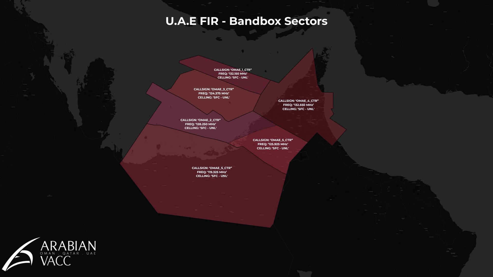

# 6. Sector Specific
<figure markdown>

</figure>

## 6.1 Sector A
### 6.1.1 Radar & Radio Limitations
Sector A covers traffic entering or exiting the U.A.E FIR via TOVOX, BUNDU, KUPRO, ORSIS, and RESAR.

If Sectors Central, and Golf are offline, Sector A will cover all of Sector Golf as well as providing service for traffic entering and exiting via TOSNA, and OVONA from Sector Central.

### 6.1.2 Typical Traffic Flows & Conflicts
Sector A handles arrivals into the Abu Dhabi TMA from the West, and departures into the Doha TMA to the West.

### 6.1.3 Coordination Requirements
Controllers shall maintain longitudinal separation minima as per Section 2.2.2.2 when coordinating with procedural FIRs.

## 6.2 Sector B
### 6.2.1 Radar & Radio Limitations
Sector B manages traffic via MUSAP, ITRAX, LABRI, RETAS, and SODEX

If Sector Lima is offline, Sector B will provide coverage for Sector Lima. 

### 6.2.2 Typical Traffic Flows & Conflicts
This sector is responsible for arrivals into the Abu Dhabi TMA from the East and manages traffic moving toward procedural FIRs.
### 6.2.3 Coordination Requirements
Controllers must apply longitudinal separation minima per Section 2.2.2.2 and coordinate carefully as surveillance fades.

## 6.3 Sector C
### 6.3.1 Radar & Radio Limitations
Sector C operates fully within radar coverage and manages traffic via ASTOG, ORMID, ALPOB, and TUMAK.

If Sector Delta is offline, Sector C will provide coverage for Sector Delta.

### 6.3.2 Typical Traffic Flows & Conflicts
Sector C handles outbound traffic from Abu Dhabi and Dubai TMAs, and inbounds into the Dubai TMA on airway L305.

### 6.3.3 Coordination Requirements
Apply longitudinal separation minima per Section 2.2.2. Coordinate per UAE & Muscat LoA for adjacent FIRs.

## 6.4 Sector D
### 6.4.1 Radar & Radio Limitations
Sector D manages traffic via KUSBA, OXARI, SISOB, DAXIB, ELOVU, GERUL, MIROT, NABIX, SENPA, and RIDAP.

### 6.4.2 Typical Traffic Flows & Conflicts
Sector C handles outbound traffic from Abu Dhabi and Dubai TMAs.

### 6.4.3 Coordination Requirements
Longitudinal separation minima as per Section 2.2.2.2 apply.

## 6.5 Sector E
### 6.5.1 Radar & Radio Limitations
Sector E manages traffic via PASOV, SOLUD, TAPRA, TARDI, MENSA, TONVO, GOMTA, LALDO, PATAT, GABXO, and KUMUN.

When Sectors Romeo, and Yankee are offline, Sector E provides top-down coverage for both of these sectors.

### 6.5.2 Typical Traffic Flows & Conflicts
Sector C handles outbound and inbound traffic from and into Dubai, Fujairah, and Ras al Khaimah TMAs.

### 6.5.3 Coordination Requirements
Longitudinal separation minima as per Section 2.2.2.2 apply.

## 6.6 Sector G
### 6.6.1 Radar & Radio Limitations
Sector G manages traffic via BOXOT, UMEVU, KAXOB, EGPOG, GIDOB, UKILI, and MEKRI

### 6.6.2 Typical Traffic Flows & Conflicts
Sector G handles inbound traffic into the Abu Dhabi TMA.

### 6.6.3 Coordination Requirements
Longitudinal separation minima as per Section 2.2.2.2 apply.

## 6.7 Sector H
### 6.7.1 Radar & Radio Limitations
Sector H manages traffic via ORDAG, DEGVO, PUXUT, ORGUR, ORLAD, ODLAL, MEPKU, LOVOK, KUMUN, KUNPI, UKROL, EGTUP, RETUX, and OTUTU.

### 6.7.2 Typical Traffic Flows & Conflicts
Sector H handles inbounds and outbound traffic from the Abu Dhabi and Dubai TMAs.

### 6.7.3 Coordination Requirements
Longitudinal separation minima as per Section 2.2.2.2 apply.

## 6.7 Sector L
### 6.7.1 Radar & Radio Limitations
Sector L manages traffic via MUSAP, ITRAX, LABRI, RETAS, and SODEX

### 6.7.2 Typical Traffic Flows & Conflicts
Sector L handles inbounds and outbound traffic from the Abu Dhabi TMA.

### 6.7.3 Coordination Requirements
Longitudinal separation minima as per Section 2.2.2.2 apply.

## 6.8 Sector M
### 6.8.1 Radar & Radio Limitations
Sector M manages traffic via PASOV, SOLUD, TAPRA, TARDI, MENSA, TONVO, GOMTA, LALDO, PATAT, GABXO, and KUMUN.

When Sectors East is offline, Sector M provides top-down coverage for Sector East, and also provides coverage for half of Sector Hotel. 

### 6.8.2 Typical Traffic Flows & Conflicts
Sector M handles inbounds and outbound traffic from the Dubai, Sharjah, Al Maktoum, Fujairah, and Ras al Khaimah TMAs.

### 6.8.3 Coordination Requirements
Longitudinal separation minima as per Section 2.2.2.2 apply.

## 6.9 Sector N
### 6.9.1 Radar & Radio Limitations
Sector N manages traffic via ORSAR, DEGSO, TOMSO, GONVI, VUTEB, and DATOB.

### 6.9.2 Typical Traffic Flows & Conflicts
Sector N handles inbounds into the Dubai TMA.

### 6.9.3 Coordination Requirements
Longitudinal separation minima as per Section 2.2.2.2 apply.

## 6.10 Sector R
### 6.10.1 Radar & Radio Limitations
Sector R manages traffic via TONVO, GOMTA, LALDO, PATAT, and GABXO.

### 6.10.2 Typical Traffic Flows & Conflicts
Sector R handles inbounds and outbound traffic from the Fujairah, and Ras al Khaimah TMAs, also providing coverage for inbounds and outbounds from the Dubai TMA.

### 6.10.3 Coordination Requirements
Longitudinal separation minima as per Section 2.2.2.2 apply.

## 6.11 Sector S
### 6.11.1 Radar & Radio Limitations
Sector S manages traffic via MEMTU, LUDID, TANSU, PEXEM, MUXIT, RIBOT, OBVUM, and EMIXI.

### 6.11.2 Typical Traffic Flows & Conflicts
Sector S handles inbounds and outbound traffic from the Dubai and Abu Dhabi TMAs.

### 6.11.3 Coordination Requirements
Longitudinal separation minima as per Section 2.2.2.2 apply.

## 6.12 Sector W
### 6.12.1 Radar & Radio Limitations
Sector W manages traffic via ORSAR, DEGSO, TOMSO, GONVI, VUTEB, and DATOB.

### 6.12.2 Typical Traffic Flows & Conflicts
Sector W handles inbounds into the Dubai TMA.

### 6.12.3 Coordination Requirements
Longitudinal separation minima as per Section 2.2.2.2 apply.

## 6.12 Sector Y
### 6.12.1 Radar & Radio Limitations
Sector Y manages traffic via 

### 6.12.2 Typical Traffic Flows & Conflicts
Sector W handles enroute traffic, as well as inbounds into the Dubai TMA via IMPED.

### 6.12.3 Coordination Requirements
Longitudinal separation minima as per Section 2.2.2.2 apply.

## 6.13 Sector Opening Order
The U.A.E FIR shall operate with the bandbox sector OMAE_1_CTR open at all times during ATC operations.

No additional sectors shall be activated unless explicit authorization is granted by the Arabian vACC staff team.

This policy ensures consistent coordination, efficient traffic handling, and proper airspace coverage. Any deviation from this configuration requires prior approval from the relevant vACC staff authority.

## 6.14 Sector Top-down Coverage
When the lower sector is offline, in addition to the designated areas of responsbility, top-down sector coverage shall be as follows:
<figure markdown>

</figure>

