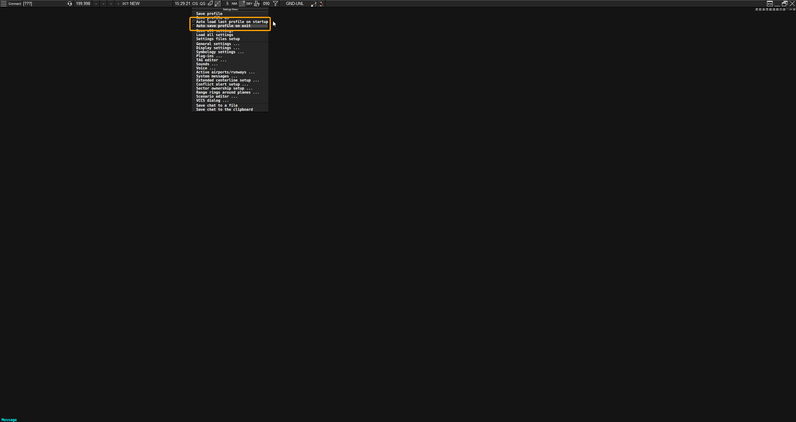

# EuroScope
## What is EuroScope?  
EuroScope is a software application that allows members to provide air traffic control on the VATSIM network. It is the primary ATC client used by controllers worldwide.

### How to Download Euroscope

- **Download EuroScope**  
     - Visit the official EuroScope website: [https://www.euroscope.hu/](https://www.euroscope.hu/).  
     - Download the latest **public release version 3.2.9**.  

- **Optional: Beta Version**  
     - You may install the latest beta version at your discretion. Be aware that some beta builds may contain bugs that could affect controlling. Follow the recommendations in this guide to determine which beta version to use.  

## Setting up Euroscope
### Initial Setup

- **Initial Setup (First Launch)**  
     - Open EuroScope for the first time without loading any profiles.  
     - Navigate to **Other Set** (next to the Zulu clock).  
     - Untick the following options:  
         - **Auto load last profile on startup**  
         - **Auto save profile on exit**  
     - This ensures you can select a profile each time you start EuroScope instead of defaulting to the Hungary profile. You may now close Euroscope and proceed to the Sector File Installation.

<figure markdown="span">
  
  <figcaption>Euroscope: Disabling Automatic Profile Loading & Saving</figcaption>
</figure>

### Sector File Installation  
- **Download the Sector Files**  
     - Sector files for the Arabian vACC are hosted on the AeroNav Association website ([files.aero-nav.com](https://files.aero-nav.com)):  
       - **OMAE** - U.A.E ([files.aero-nav.com/OMAE](https://files.aero-nav.com/OMAE))  
       - **OTDF** - Doha ([files.aero-nav.com/OTDF](https://files.aero-nav.com/OTDF))  
       - **OOMM** - Muscat ([files.aero-nav.com/OOMM](https://files.aero-nav.com/OOMM))  

- **Install the Sector Files**  
     - For first-time installation, download the **Install-Package**.  
     - Extract the files to a dedicated sector file folder (e.g., `Documents/Euroscope/Sector Files`).  
     - Create a new folder inside that directory with the FIR code (e.g., `OMAE`).  

<figure markdown="span">
  
  <figcaption>Euroscope: Storing your Sector Files</figcaption>
</figure>

- **Explore the Extracted Files**  
     - **Profile Files (.prf):** Found for each aerodrome, terminal, and enroute sector.  
     - **Alias.txt File:** Located in `FIR CODE/Alias`, containing shortcut commands for text communication.  
     - **vATIS Profiles:** Located in `FIR CODE/Plugins/vATIS` for the specific FIR.  

### Using the Sector Files  
- **Load a Profile**  
     - The sector file is "plug and play." Once extracted, open the desired profile to start observing.  
     - Profiles are organized by position:  
         - **Aerodrome Profiles:** For Delivery, Ground, and Tower controllers. Includes AIR Radar and GMC Surface Movement Guidance and Control (SMGCS) displays.  
         - **Terminal Profiles:** For Departure and Arrival controllers. Includes radar views for the terminal area and SMGCS displays for relevant aerodromes.  
         - **Area Profiles:** For enroute controllers. Covers the entire FIR and SMGCS displays for all aerodromes.  
         - **Military Profiles:** For military aerodromes in the FIR.  

- **Switch Between Views**  
     - Upon loading a profile, you will see the **AIR Aerodrome View** centered on the aerodrome you selected.  
     - To open the **SMGCS Ground Display**, press ++f1+2++. This view shows the airport’s ground layout.  
     - To return to the **AIR Aerodrome View**, press ++f1+1++.

<figure markdown="span">
  
  <figcaption>Euroscope: AIR Aerodrome View F1+1</figcaption>
</figure>

<figure markdown="span">
  
  <figcaption>Euroscope: SMGCS Ground View F1+2</figcaption>
</figure>

You’re now ready to start using EuroScope for observing or controlling on the VATSIM network. For further assistance, ask your questions in the Arabian vACC Discord in the Training-Text channel or the mentoring/instructor team.

## Observing with Euroscope