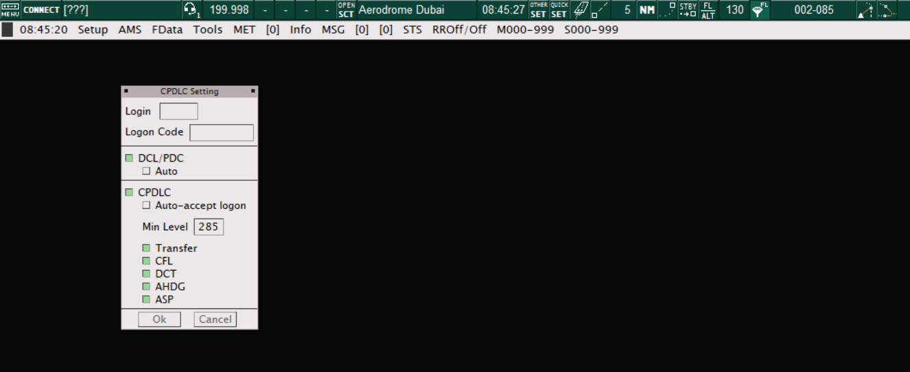

# 18. Datalink Functions
## 18.1 Set up
All Arabian vACC sector files are equipped with datalink function, including datalink clearance, wherever applicable, as well as en route CPDLC. The datalink funtions make use of the Hoppie ACARS system.

Datalink requires minimal setup out of the box. However, controllers will require a unique Hoppie code which is available [here](https://www.hoppie.nl/acars/).

To log in, controllers will need to navigate to the TopSky menu bar (usually on the Air view), select "Setup" then "CPDLC Setting". This action will open the "CPDLC Setting" window. 

<figure markdown>

</figure>
<figure markdown>
  <figcaption>Figure 18-1: Topsky Menu</figcaption>
</figure>

<figure markdown>

</figure>
<figure markdown>
  <figcaption>Figure 18-2: CPDLC Setting window</figcaption>
</figure>

Here, controllers will then need to set the appropriate station identifier in the "Login" field. This usually corresponds to the aerodrome ICAO code (e.g. OMDB), however, in the case of en route positions, this will correspond to the FIR ICAO code (e.g. OMAE). Other codes may be defined in accordance with specific aerodrome SOPs.

Next, the hoppie code will need to be inserted into the "Logon Code" field.

Once all information is correctly inserted, controllers press the "Connect" button which will bring the CPDLC functions online.

### 18.2 Using Datalink Clearance (DCL)
Use of datalink clearance is fairly straightforward, as the funtionality is built in to the departure list of all Arabian vACC sector files.

When a pilot requests clearance via datalink, a yellow `RCD` will be indicated under the "DCL" field of the departure list. To open the DCL window, controllers must **left-click** the `RCD` field. Here, all relevant information must be checked, and assigned if required. Particular attention must be paid to the assigned SID, initial cleared altitude, squawk code as well as the next frequency (if applicable).

Once the clearance is ready, controllers will press the "Send DCL" button, which will uplink the datalink clearance to the pilot's aircraft. This action will also change the yellow `RCD` to a white `SENT` on the DCL field on the departure list.

Once accepted by the pilot, the DCL field will change to `DONE` and the clearance flag will be automatically filled in white by the plugin.