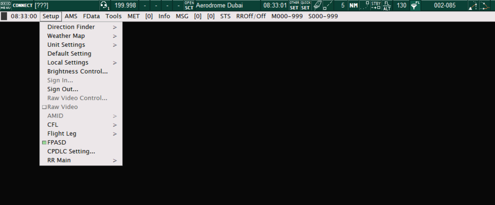
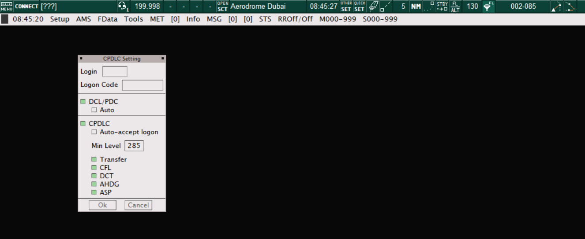

# 18. Datalink Functions
## 18.1 Set up
All Arabian vACC sector files are equipped with datalink functions, including datalink clearance, wherever applicable, as well as en route CPDLC. The datalink funtions make use of the Hoppie ACARS system.

Datalink requires minimal setup out of the box. However, controllers will require a unique Hoppie code which is available [here](https://www.hoppie.nl/acars/).

To log in, controllers navigate to the TopSky menu bar (usually on the Air view), select "Setup" then "CPDLC Setting". This action opens the "CPDLC Setting" window. 

<figure markdown>

</figure>
<figure markdown>
  <figcaption>Figure 18-1: Topsky Menu</figcaption>
</figure>

<figure markdown>

</figure>
<figure markdown>
  <figcaption>Figure 18-2: CPDLC Setting window</figcaption>
</figure>

Here, controllers set the appropriate station identifier in the "Login" field. This usually corresponds to the aerodrome ICAO code (e.g. OMDB), however, in the case of en route positions, this corresponds to the FIR ICAO code (e.g. OMAE). Other codes may be defined in accordance with specific aerodrome SOPs.

Next, the hoppie code is inserted into the "Logon Code" field.

Once all information is correctly inserted, controllers press the "Connect" button which will bring the CPDLC functions online.

### 18.2 Using Datalink Clearance (DCL)
Use of datalink clearance is fairly straightforward, as the funtionality is built in to the departure list of all Arabian vACC sector files.

When a pilot requests clearance via datalink, a yellow `RCD` is indicated under the "DCL" field of the departure list, meaning a DCL request has been recieved by TopSky. To open the DCL window, controllers **left-click** the `RCD` field. Here, all relevant information must be checked, and assigned if required. Particular attention must be paid to the assigned SID, initial cleared altitude, squawk code as well as the next frequency (if applicable).

Once the clearance is ready, controllers press the "Send DCL" button, which will uplink the datalink clearance to the pilot's aircraft. This action will also change the yellow `RCD` to a white `SENT` on the DCL field on the departure list.

Once accepted by the pilot, the DCL field changes to `DONE` and the clearance flag will be automatically filled in white by the plugin.

### 18.3 Using Controller Pilot Datalink (CPDLC)
CPLDC functions are built in to the TopSky tags.

When a pilot requests a logon, the aircraft callsign is highlighted by a pair of flashing square brackets, indicating that a logon request on CPDLC has been received.

To commence the CPDLC service, controllers press the "Start CPDLC" button located on the callsign menu drop-down.

Once the CPDLC service has been commenced, the flashing square brackets around the callsign change to steady brackets, indicating that a CPDLC link is now active with the aircraft.

Whilst CPDLC is active, any changes made to the tag, such as level changes, direct-to, etc are automatically uplinked to the pilot as a CPDLC instruction and highlighted in blue. Once the instruction is accepted by the pilot, the respective tag will field changes to the default colour.

To end the CPDLC service, controllers press the "End CPDLC" button on the callsign menu drop-down.