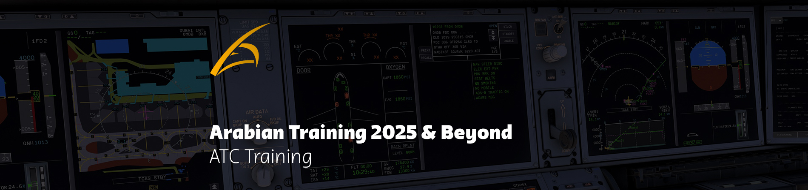

<figure markdown>

</figure>

# 📢 Training Announcement – ATC Training Resumption

Dear Members,  

As many of you know, ATC training has been on hold for some time while we managed intake flow. The main reason for this pause was an imbalance between the number of students and the availability of mentors and instructors.  

During this period, the ATC Training Department has been working extensively to **rebuild the training program from scratch**. This includes:  

- Rewritten **session reports**  
- Detailed **syllabuses for each rating**  
- Comprehensive **self-study courses**  
- A brand-new **question bank** for Tier-1 theoretical exams (over **500+ questions**)  

---

## ✈️ Addressing the Core Issues

One of the biggest issues we identified was at the **S1 level**, where initial sessions were consumed by teaching theory. These sessions often lasted 2–3 hours covering knowledge that should have already been studied beforehand.  

To solve this:  

- **Self-study** is now emphasized as the foundation before mentoring begins.  
- All **initial training will take place outside of Dubai**, as Dubai’s complexity (layout, restrictions, RRSM, etc.) is not suitable for new controllers.  
- Controllers will be required to meet the **Dubai Tier-1 Endorsement requirements**, as outlined in the ATC Training Policy.  

---

## 📚 Essential Resources  

- **Getting Started Guide (OBS → S1):**  
  👉 [Getting Started - ATC Training](https://library.arabian-vacc.com/getting_started/starting_atc_training/) Every step to begin your ATC journey is explained here, including how to become a **resident of the vACC**. Please read this guide carefully before asking questions.  

- **ATC Training Policy:**  
  👉 [ATC Training Policy](https://library.arabian-vacc.com/policies/atc_training/general/) This policy covers expressions of interest, waiting lists, active training, airports, CTAs/TMAs, ACCs, progression requirements, endorsements (Tier-1 & upcoming Tier-2), and activity requirements.  

- **What to Expect During Sessions:**  
    - [S1](https://library.arabian-vacc.com/policies/atc_training/s1/)  
    - [S2](https://library.arabian-vacc.com/policies/atc_training/s2/)  
    - [S3](https://library.arabian-vacc.com/policies/atc_training/s3/)  
    - [C1](https://library.arabian-vacc.com/policies/atc_training/c1/)  

---

## 🖥️ Self-Study Courses & Seminars  

- **OBS → S1 Controllers** will have access to a new **Moodle self-study course** (👉 moodle.arabian-vacc.com).  
    - Access instructions are in the **Getting Started Guide** (please read it carefully).  
    - The course includes several modules covering most theoretical knowledge.  
    - Each module has **progress checks** to ensure proper understanding.  
    - The course is completed once the **MENA S1 theoretical exam** is passed.  

- **S2 and beyond:**  
    - No Moodle courses (yet) – these are still in development.  
    - Controllers will instead attend **seminars** covering the **core foundations** of each rating.  
    - Remember: SOPs for your designated training airport or TMA must be studied independently.  

---

## 📑 SOP Progress  

- ✅ Muscat TMA SOP – Fully completed  
- ✅ Muscat Aerodrome SOP  
- ✅ Hamad Aerodrome SOP  
- ✅ Abu Dhabi Aerodrome SOP (TMA still in progress)  
- ✅ Sharjah Aerodrome SOP  
- ⏳ Doha TMA SOP – Near completion  
- ⏳ Abu Dhabi TMA SOP – In progress  

---

## 🔄 Reset of Training Plans  

To ensure a **fresh start**:  

- All **Hayya training plans have been reset**.  
- Only controllers currently in active training near completion remain in their plans.  
- Controllers who did not meet **Tier-1 endorsement requirements** have been removed.  

For those going **OBS → S1**, the majority of the work is now in your hands with the new self-study program.  

---

## 📝 Reminders for All Controllers  

- **Euroscope User Guide (since Dec 2024):**  
  👉 https://library.arabian-vacc.com/getting_started/euroscope/  

- **Audio Client User Guide (since Dec 2024):**  
  👉 https://library.arabian-vacc.com/getting_started/audio/  

- **vATIS Client User Guide (since Dec 2024):**  
  👉 https://library.arabian-vacc.com/getting_started/vatis/  

- **vATIS Update Requirement:**  
  All controllers must update their vATIS client, refresh their profiles to the latest automatic ones:  
  👉 https://github.com/Arabian-vACC/vATIS-Profiles/releases  
  and ensure correct **Airport Conditions & NOTAMs** are selected (*looking at you, Hamad controllers – “HIRO INFORCE”*).  

- **Controller Operations Policy:**  
  👉 https://library.arabian-vacc.com/policies/atc_operations/controller_operations_policy/  
  Covers connection procedures, minimum session time, Discord presence, relief callsigns, and more.  

- **General Marketing Policy (released Aug 18th):**  
  👉 https://library.arabian-vacc.com/policies/marketing/general/#event-signup  
  Outlines **Event Rostering rules and regulations**.  

---

# 📆 Training Resumes: **Monday, September 22nd, 2025**

On this date, **support tickets to express your interest in ATC training will reopen**, and the **new training program will officially launch**.