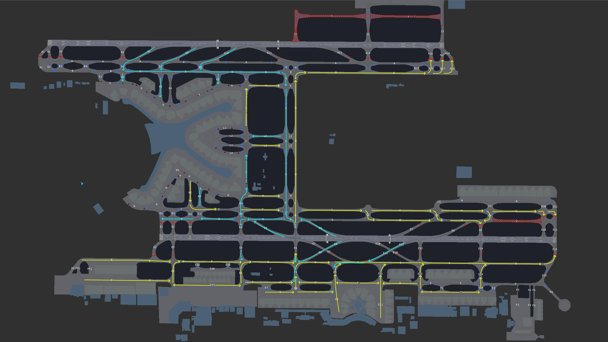

# Arriving Traffic
!!! success "Check"
    All pilots should also familiarise themeselves with the [Airport Overview](../overview)

## STAR Assignment
STAR assignments are based on the waypoint at which you enter the Abu Dhabi Terminal Maneuvering Area (TMA). ATC will assign the appropriate STAR depending on traffic conditions and active runway.

!!! warning
    All STARs into Abu Dhabi include altitude and speed restrictions, which must be adhered to unless explicitly canceled by ATC. Pilots should verify clearance levels through instructions such as "**DESCEND VIA STAR**," "**DESCEND UNRESTRICTED**," or "**CANCEL STAR SPEEDS**."

## Runway Assignment
The arrival runway is specified in the Abu Dhabi Arrival ATIS, with a preference for runway 31R for arrivals. Abu Dhabi operates Simultaneous Independent Runway Operations (SIRO), which allows both runways to be utilised for arriving and departing aircraft, allowing the airport to maximise traffic flow.

## Approach
The standard approach at Abu Dhabi is the ILS, however the expected approach can be found in the Abu Dhabi Arrival ATIS. ATC may tactically assign a different approach, and in this case always follow ATC instructions.

## Speeds
The speed limits and recommended speeds within different segments of the Abu Dhabi terminal area is as follows:

|  Speed Range  |              Arrival Segment              |
|:-------------:|:-----------------------------------------:|
| 210 - 250 kts |           Initial approach phase          |
| 180 - 230 kts |         From downwind to base leg         |
| 160 - 210 kts |                 On base leg               |
|    180 kts    |                Until 10 DME               |
|    160 kts    |                Until 4 DME                |

All speed restrictions must be adhered to as accurately as possible. Aircraft unable to comply with these restrictions must notify ATC in advance and specify the speeds they can maintain. Pilots should also inform ATC if circumstances require a speed adjustment for any reason.  

To ensure accurate spacing, pilots are requested to comply with speed adjustments as promptly as practicable, considering their operational constraints.  

If traffic sequencing does not require speed limitations, ATC will advise, “**NO ATC SPEED RESTRICTION**.”  

## Landing
### Minimum Runway Occupancy
During peak traffic periods, rapid runway vacating is essential to prevent disruption to the aerodrome traffic flow. Ensure your entire aircraft has passed the designated runway holding point before considering yourself clear. Avoid unnecessary stops before exiting completely.

All rapid exit taxiways are equipped with rapid taxiway indicator lights. Pilots should maintain the designated exit taxi speed of 50 knots.

!!! info
    Pilots should plan their roll out to the earliest rapid exit taxiway possible (unless a specific exit has been assigned by ATC). Arriving aircraft shall not stop on the runway exit and should continue rolling past the stop bar.

### ILS Glidepath Fluctuations
Aircraft may experience glidepath signal fluctuations during Cat 1 conditions due to taxiing and departing aircraft. Pilots should be prepared for potential glidepath interference and closely monitor their ILS profile, flight display indications, and autopilot behavior during both manual and coupled ILS approaches.

## Taxi
Your intial taxi after landing will be given by the TWR controller, who will then hand you over to the appropriate GND controller for further taxi to stand. The below taxi diagrams depict the standard taxi routings. Note that it may be necessary for operational reasons to deviate from these routings and pilots should follow ATC instructions at all times.

### Runway 31L/R Configuration
<figure markdown>

</figure>

### Runway 13L/R Configuration
<figure markdown>

</figure>