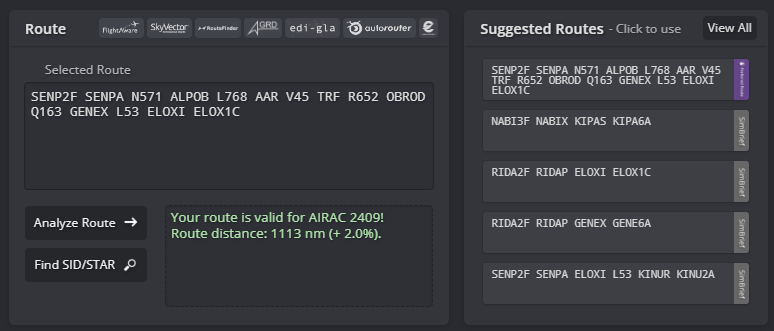
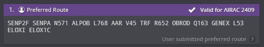

# Departing Traffic
## Flight Planning: Route(s)
Pilots can find valid routes for most flights departing from Abu Dhabi on SimBrief by choosing the "Preferred Route" option. Our operations department updates the "Preferred Route" on SimBrief with every AIRAC cycle, ensuring compliance with Air Traffic Flow Management (ATFM) regulations in the Middle East and Eurocontrol IFPS validation.

<figure markdown>
{ width="600" }
  <figcaption>Figure 1-1: Simbrief Preferred Route</figcaption>
</figure>

<figure markdown>
{ width="600" }
  <figcaption>Figure 1-2: Simbrief Preferred Route</figcaption>
</figure>

## Flight Planning: Standard Instrument Departure (SID)
Controllers will assign a Standard Instrument Departure (SID) based on the first waypoint in your flight plan, guiding you out of the Abu Dhabi Terminal Maneuvering Area (TMA). Refer to the table below to see which SID you can expect. If your waypoint isn't listed in the table, ensure your AIRAC cycle is up to date. If your AIRAC is outdated, please inform the controller promptly so we can arrange an omnidirectional departure for you.