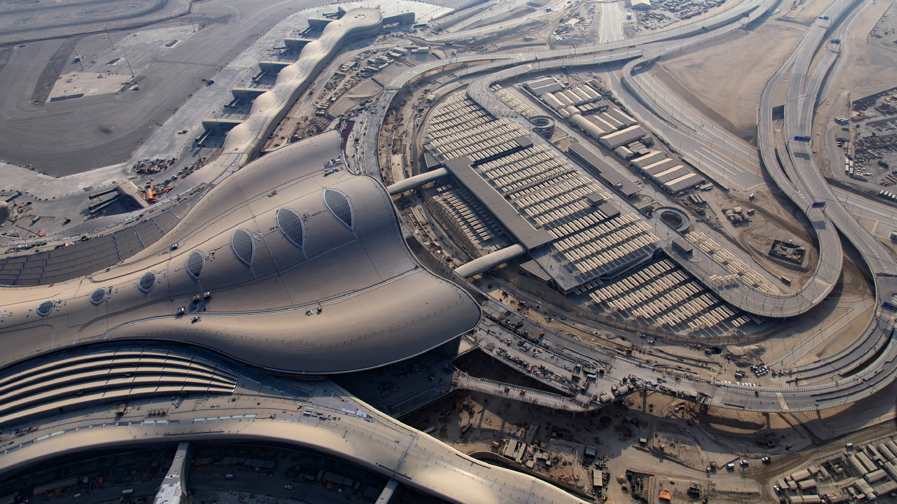

# Airport Overview
## Information

<figure markdown>

</figure>

| IATA | ICAO | Charts | NOTAM(s) |
|:----:|:----:|:------:|:----------:|
| AUH  | OMAA | [U.A.E eAIP](https://www.gcaa.gov.ae/en/ais/aip-view-package)    | [U.A.E FIR - NOTAM(S) ](https://www.gcaa.gov.ae/en/ais/notice-to-airmen-notam)      |

Zayed International Airport, also known as Abu Dhabi International Airport, is the main international airport serving Abu Dhabi, the capital city of the United Arab Emirates (UAE). It is the second busiest airport in the UAE after Dubai International Airport and one of the busiest in the Middle East. The airport serves as a hub for Etihad Airways and an operating base for Wizz Air Abu Dhabi and Air Arabia Abu Dhabi.

Located 16.5 nautical miles east of Abu Dhabi. It is served by 24 airlines connecting to 128 destinations. On February 9, 2024, the airport was renamed Zayed International Airport in honor of Sheikh Zayed bin Sultan Al Nahyan, the UAE's founding father.

## Charts & Scenery
Pilots can access the latest charts through the following sources: [Chartfox (Free, VATSIM login required)](https://chartfox.org/), [the U.A.E eAIP (Free)](https://www.gcaa.gov.ae/en/ais/aip-view-package), or [Navigraph (Subscription required)](https://navigraph.com/).

| Simulator      | Freeware        | Payware                            |
|----------------|-----------------|------------------------------------|
| MSFS           |                 | [iniBuilds](https://inibuilds.com/products/inibuilds-zayed-omaa-msfs) |
| X-Plane        | X-Plane Default | [TAIMODELS](https://store.x-plane.org/OMAA--Abu-Dhabi-International-Airport_p_1471.html) |
| Prepar3D V4/V5 | [AVSIM](https://library.avsim.net/search.php?SearchTerm=OMAA&CatID=fsxscen&Go=Search) | [SimBreeze](https://secure.simmarket.com/simbreeze-abu-dhabi-omaa-p3d5.phtml) |

## Stand Assignments
Since 2023, passenger operations have been based out of Terminal A. Passenger aircraft can expect to be allocated to Apron 6, unless traffic constraints mean overflow parking needs to be utilised

|            Area           |        Stand Allocation       |     Operator                             |
|:-------------------------:|:-----------------------------:|:----------------------------------------:|
|         Apron 1/1A        |          101 to 136           |       Overflow                           |
|         Apron 2           |          201 to 222           |       Cargo, low-cost                    |
|         Apron 3           |          301 to 309           |       Overflow                           |
|         Apron 4           |          401 to 410           |       Overflow                           |
|         Apron 5           |          508 to 516           |       Cargo, overflow                    |
|         Apron 6           |          601 to 690           |       All Passenger                      |
|         Apron 7           |          704 to 715           |       Overflow                           |
|         Apron 8           |          801 to 805           |       General aviation                   |
| Presidential Flight Apron |          1 to 17              |       Government and state aircraft      |

!!! info
    All arriving aircraft will be assigned stands by our stand assigner. Commercial passenger aircraft can expect to be accommodated on Apron 6, and cargo can expect Apron 5

## Air Traffic Control Positions

| Logon Callsign   | Radio Callsign           | Frequency | Area of Responsibility Comment   |
|------------------|-------------------------|-----------|----------------------------------|
| OMAA_DEL         | Abu Dhabi Delivery      | 125.100   | All IFR and VFR Clearances               |
| OMAA_1_GND       | Abu Dhabi Ground        | 123.975   | Primary Ground Position, covering south side when split             |
| OMAA_2_GND       | Abu Dhabi Ground        | 120.425   | Central Ground Control           |
| OMAA_3_GND       | Abu Dhabi Ground        | 121.950   | North Ground Control             |
| OMAA_1_TWR       | Abu Dhabi Tower         | 119.200   | Primary Tower Position, South Tower Control when split              |
| OMAA_2_TWR       | Abu Dhabi Tower         | 118.675   | North Tower Control              |
| OMAA_I_APP       | Abu Dhabi Information   | 119.200   | Flight Information Service       |
| OMAA_C_APP       | Abu Dhabi Radar         | 124.400   | Central Approach Radar           |
| OMAA_W_APP       | Abu Dhabi Radar         | 128.100   | West Approach Radar              |
| OMAA_N_APP       | Abu Dhabi Radar         | 135.150   | North Approach Radar             |
| OMAA_E_APP       | Abu Dhabi Radar         | 133.550   | East Approach Radar              |
| OMAA_F_APP       | Abu Dhabi Director      | 118.425   | North Director                   |
| OMAA_G_APP       | Abu Dhabi Director      | 118.000   | South Director                   |

!!! Warning
    It's crucial that you pay close attention to the frequency you're being transferred to. Do not attempt to guess the next frequency, and never switch frequencies without explicit instructions from the controller. Auto-handoffs are not used at Dubai International. If you're unsure, don’t hesitate to ask for the frequency again!

## Reduced Runway Separation Minima (RRSM)
Reduced runway separation may be implemented at any time, day or night, under the following scenarios:

- A departing aircraft followed by another aircraft departing from the same runway.
- Two consecutive landing aircraft.
- Two consecutive departing aircraft.

### Conditions for Application:

- The tailwind component does not exceed **5 knots** at the landing threshold, and there are no pilot reports of **wind shear**.
- Meteorological visibility is at least **5000 metres**, and the cloud ceiling is not below **1000 feet**. The AIR controller must be confident that the following aircraft can **continuously and completely observe** the relevant traffic.
- Traffic information is provided to the crew of the **succeeding aircraft**.
- The runway is **dry**, with no indications that braking action will be adversely affected.
- The AIR controller must be able to assess separation **visually** or using **radar-derived information**.
- Suitable **landmarks and surface surveillance markers** must be available to assist in assessing aircraft separation.
- **Wake turbulence separation minima** must be maintained.
- **Minimum separation** must still exist between two departing aircraft **immediately after** the second aircraft takes off.
- The pilot of an arriving aircraft must be informed of the **expected exit point** for runway vacating.