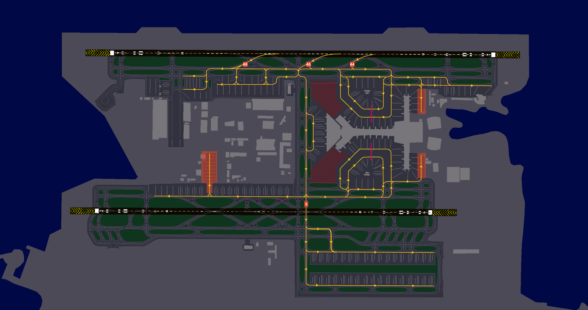

# Arriving Traffic
## STAR Assignment
STAR assignments are based on the waypoint at which you enter the Doha Terminal Maneuvering Area (TMA). The table below outlines the possible STARs for each entry point. ATC will assign the appropriate STAR depending on traffic conditions, with a preference for the shortest available routing whenever possible.

!!! note
    It is essential to highlight that the following arrival procedures are applicable to both Doha (OTBD) and Hamad (OTHH) airports. These procedures are not airport-specific.  

    Aircraft can be sequenced on any of the STARs that guide them either to the east or west downwinds, depending on sector capacity.

### 16L/R Arrivals
| Procedure |        Type        | Length | Downwind |
|:---------:|:------------------:|:------:|:--------:|
|  ALKAN1F  |      Trombone      |  Long  |   West   |
|  ALKAN1H  | Direct to Downwind |  Short |   East   |
|  ALKAN1P  |      Trombone      |  Long  |   East   |
|  LAEEB1F  | Direct to Downwind |  Short |   West   |
|  LAEEB1K  |      Trombone      |  Long  |   West   |
|  ORLEK1F  |      Trombone      |  Long  |   West   |
|  TOSNA1P  | Direct to Downwind |  Short |   East   |
|  TOSNA1T  |      Trombone      |  Long  |   East   |
|  TOSNA2F  |      Trombone      |  Long  |   West   |
|  TOVOX1P  | Direct to Downwind |  Short |   East   |
|  TOVOX2F  |      Trombone      |  Long  |   West   |
|  VEDED1F  |      Trombone      |  Long  |   West   |
|  VEDED1H  | Direct to Downwind |  Short |   East   |
|  VEDED1P  |      Trombone      |  Long  |   East   |

### 34L/R Arrivals
| Procedure |        Type        | Length | Downwind |
|:---------:|:------------------:|:------:|:--------:|
|  ALKAN1L  |      Trombone      |  Long  |   West   |
|  ALKAN1R  |      Trombone      |  Long  |   East   |
|  ALKAN1V  | Direct to Downwind |  Short |   East   |
|  LAEEB1J  |      Trombone      |  Long  |   West   |
|  LAEEB1L  | Direct to Downwind |  Short |   West   |
|  ORNEL1L  | Direct to Downwind |  Short |   West   |
|  TOSNA1J  |      Trombone      |  Long  |   West   |
|  TOSNA1R  | Direct to Downwind |  Short |   East   |
|  TOSNA1V  |      Trombone      |  Long  |   East   |
|  TOSNA2L  |      Trombone      |  Long  |   West   |
|  TOVOX1R  | Direct to Downwind |  Short |   East   |
|  TOVOX2L  |      Trombone      |  Long  |   West   |
|  VEDED1L  |      Trombone      |  Long  |   West   |
|  VEDED1R  |      Trombone      |  Long  |   East   |
|  VEDED1V  | Direct to Downwind |  Short |   East   |

!!! warning
    All STARs into Doha-Hamad include altitude and speed restrictions, which must be adhered to unless explicitly canceled by ATC. Pilots should verify clearance levels through instructions such as "**DESCEND VIA STAR**," "**DESCEND UNRESTRICTED**," or "**CANCEL STAR SPEEDS**."

## Runway Assignment
Runway assignments are issued by Doha Radar or Doha Approach and may be given with short notice during high-traffic periods. Pilots should be prepared for all arrival runways listed in the ATIS.

If the aircraft supports a secondary flight plan, pilots should preload an alternate arrival runway to facilitate a swift transition if required.

## Approach
The standard approach at Doha-Hamad is the ILS, with independent parallel operations in effect. Pilots can expect a minimum diagonal separation of 3 NM from traffic on the opposite runway and 2 NM spacing from preceding aircraft on the opposite runway.

## Speeds
The speed limits and recommended speeds within different segments of the Doha terminal area is as follows:

|  Speed Range  |              Arrival Segment              |
|:-------------:|:-----------------------------------------:|
| 230 - 210 kts |           Initial approach phase          |
|    180 kts    | Base leg/closed heading to final approach |
|    180 kts    |                Until 10 DME               |
|    160 kts    |                Until 4 DME                |

!!! note
    Aircraft subject to speed restrictions on final with DME constraints may be instructed by ATC to comply with "**STANDARD SPEEDS**" meaning pilots are expected to maintain these speeds until final approach.  

    For the A380, the speed sequence is as follows: 180 until 10 DME and 160 kts until 5 DME.

All speed restrictions must be adhered to as accurately as possible. Aircraft unable to comply with these restrictions must notify ATC in advance and specify the speeds they can maintain. Pilots should also inform ATC if circumstances require a speed adjustment for any reason.  

To ensure accurate spacing, pilots are requested to comply with speed adjustments as promptly as practicable, considering their operational constraints.  

If traffic sequencing does not require speed limitations, ATC will advise, “**NO ATC SPEED RESTRICTION**.”  

## Landing
### High Intensity Runway Operations (HIRO)
During peak traffic periods, rapid runway vacating is essential to prevent go-arounds for following aircraft. Ensure your entire aircraft has passed the designated runway holding point before considering yourself clear. Avoid unnecessary stops before exiting completely.

All rapid exit taxiways are equipped with rapid taxiway indicator lights. Pilots are encouraged to maintain the designated exit taxi speed of 50 knots.

| Runway |     Standard Rapid Exit   |
|:------:|:-------------------------:|
|   16L  |            A7             |
|   16R  |            M7             |
|   34L  |            M8             |
|   34R  |            A5             |

!!! warning
    Do not vacate the runway via A6 or L7 unless explicitly instructed by ATC.

!!! info
    Pilots are expected to vacate the runway using standard exit procedures unless instructed otherwise by the tower controller. If unable to comply with High-Intensity Runway Operations (HIRO), advise tower on first contact.

### ILS Glidepath Fluctuations
Aircraft arriving on Runway 34L may experience glidepath signal fluctuations due to taxiing and departing aircraft. Pilots should be prepared for potential glidepath interference and closely monitor their ILS profile, flight display indications, and autopilot behavior during both manual and coupled ILS approaches.

## Taxi
After landing, aircraft must not stop on the rapid exit taxiways and shall continue taxiing according to the following procedures unless otherwise instructed by the tower controller:  

- **Runway 16L:** Continue via B southbound.  
- **Runway 16R:** Continue via K or M southbound.  
- **Runway 16R (Apron 5 Parking):** Expect a northbound turn onto K (HIRO not applicable).  
- **Runway 34L:** Continue via M northbound unless instructed to vacate to the east (if vacating east, HIRO not applicable).  
- **Runway 34R:** Continue via B northbound.  

### Runway 16s Configuration
#### Arrivals, Runway 16L
<figure markdown>

</figure>

#### Arrivals, Runway 16R
<figure markdown>

</figure>

### Runway 34s Configuration
#### Arrivals, Runway 34L
<figure markdown>

</figure>

#### Arrivals, Runway 34R
<figure markdown>

</figure>

