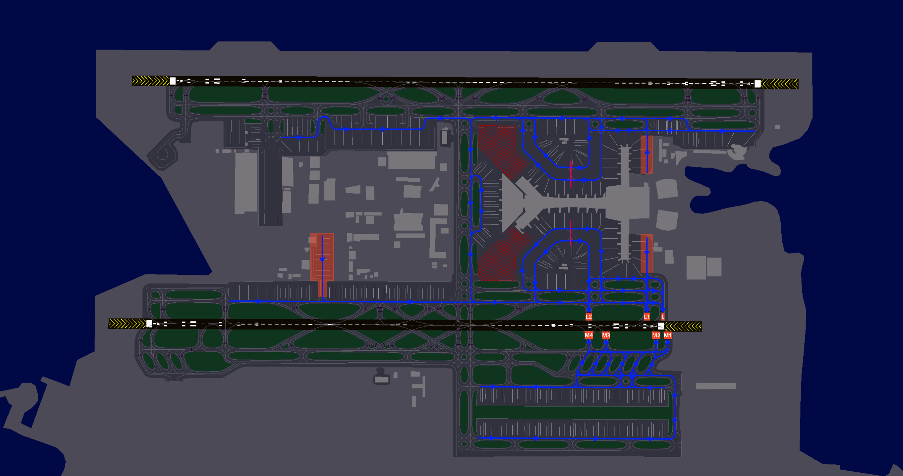

# Departing Traffic
## Flight Planning: Route(s)
Pilots departing from Doha-Hamad can obtain valid routes through SimBrief by selecting the "Preferred Route" or "IFPS Compliant Route" option. Our operations department updates the SimBrief database with each AIRAC cycle to ensure compliance with Air Traffic Flow Management (ATFM) regulations in the Middle East and Eurocontrol IFPS validation.

<figure markdown>
{ width="600" }
  <figcaption>Figure 1-1: Simbrief IFPS compliant Route</figcaption>
</figure>

<figure markdown>
{ width="600" }
  <figcaption>Figure 1-2: Simbrief Preferred Route</figcaption>
</figure>

### Flight Planning: Standard Instrument Departure (SID)
Controllers will assign a Standard Instrument Departure (SID) based on the first waypoint in your flight plan to guide you out of the Doha Terminal Maneuvering Area (TMA). Refer to the table below to determine the expected SID. If your waypoint is not listed, ensure your AIRAC cycle is up to date. If using an outdated AIRAC, notify the controller promptly so an RNAV radar-vectored departure or an omnidirectional departure can be arranged.

| Waypoint |  16L  |  16R  |  34L  |  34R  | 
|----------|:-----:|:-----:|:-----:|:-----:|
| ALSEM    |  2M   |   -   |   -   |  2E   |
| ALVEN    |  2M   |   -   |   -   |  3E   |
| BUNDU    |   -   |  2C   |   -   |  2E   |
| DATRI    |   -   |  1C   |  1W   |   -   |
| DEMBO    |   -   |   -   |   -   |   3   |
| IVENA    |   -   |   2   |   -   |   -   |
| KASIS    |   2   |   -   |   -   |   -   |
| KUPRO    |  1M   |   -   |   -   |  1E   |
| LUBET    | 1M/1Y |  1C   | 1A/1W | 2E/2Z |
| PARES    |   -   |   -   |   2   |  7F   |
| TULUB    |  1M   |  1C   | 1A/1W |  2E   |
| ULIKA    |   -   |  1C   | 1A/1W |   -   |
| VAXIN    |  2M   |   -   |   -   |  2E   |

!!! Note
    The departures listed above are runway-specific and cannot be used on any runway other than those published. As a result, your clearance will not specify a designated runway. Pilots must cross-check their charts to determine their assigned departure runway. For example, if parked on Apron 6 and assigned Runway 34R, expect a long taxi.

## Getting your clearance
Departing aircraft shall contact Hamad Clearance Delivery **10 minutes prior to their estimated off block time (EOBT)** and pass the following information:
<ul>
    <li>Aircraft Callsign</li>
    <li>Aircraft Type</li>
    <li>Parking Stand</li>
    <li>Requested Flight Level</li>
    <li>Destination</li>
</ul>

### Datalink Clearance (DCL)
The preferred method for obtaining your clearance is through datalink. To request clearance via Hoppie datalink, send your request to **OTHH**. Please note that logging on to the station is not required. No readback is necessary.

### Voice Clearance
At Doha-Hamad, if datalink clearances are unavailable, voice clearances will be provided. These will be brief, covering only your Standard Instrument Departure (SID), initial climb, and squawk code. Ensure you have the latest departure ATIS information before proceeding.

!!! example
    **Pilot**: "Hamad Clearance Delivery, QTR6M, Boeing 777-300ER, information X, stand B3, requesting FL310, to Melbourne."

    **Controller**: "QTR6M, Hamad Clearance Delivery, information X correct, cleared to Melbourne via the BUNDU2E departure, climb via the SID to altitude 4000ft, squawk 2613."

    **Pilot**: "Cleared to Melbourne via the BUNDU2E departure, climb via the SID to altitude 4000ft, squawk 2613, QTR6M."

    **Controller**: "QTR6M, readback correct, QNH 1016, report ready for pushback."

!!! warning
    Clearance delivery will not provide push and start clearance. However, remain on the clearance delivery frequency; do not switch to the ground frequency on your own. You must report fully ready on the delivery frequency—this includes having the jetway disconnected, tug connected, and chocks removed. Delivery will advise when to switch to the appropriate ground frequency, based on the current airport departure rate.

### Airport Collaborative Decision Making (A-CDM)
Doha-Hamad has implemented **A**irport **C**ollaborative **D**ecision **M**aking (**A-CDM**) procedures to ensure efficient operations and reduce time spent at the holding point. Pilots are required to adhere to assigned A-CDM times. When A-CDM procedures are in effect, this will be announced in the ATIS. Pilots should set their **T**arget **O**ff **B**lock **T**ime (**TOBT**) and update it whenever their estimate changes by more than 5 minutes using the [VATMENA vACDM Pilot Interface](https://vacdm.vatsim.me), aiding controllers in departure planning.

If you are unfamiliar with A-CDM procedures, please refer to the [A-CDM pilot guide](https://vacdm.net/docs/pilot/use-vacdm).

#### A-CDM Regulations
Please follow the procedures below in accordance with the airport briefing charts and VACDM policy:

- 🖥️ **TOBT must be submitted via [vacdm.vatsim.me](https://vacdm.vatsim.me)**
- ⏳ **Clearance must be requested no later than 25 minutes before EOBT**
- 🔊 **TSAT updates will be communicated by voice only via ATC frequency**
- 🕒 **Pushback must occur within ±2 minutes of the assigned TSAT**
- ⚠️ **If unable to push back within +5 minutes after TSAT:**
  - 📞 Inform ATC
  - 🔄 Submit a new TOBT via VACDM for a new TSAT
- 🚫 **Do not contact ATC or report ready for start-up prior to your TSAT**

## Push & Start
Once clearance delivery releases you to the designated ground frequency, pilots may request push and start clearance. Upon initial contact, the ground controller may provide various types of pushback instructions. Pilots must ensure they can comply with these instructions; if unable, they must inform the ground controller.

Pushback clearances will specify a direction to face, such as West or East, and a particular taxiway to push onto.

!!! example
    **Controller**: "QTR6M, push and start is approved face south onto taxiway E1."

!!! warning
    If pilots are unable to commence pushback within 2-3 minutes, the pushback clearance may be revoked, and slot times will be recalculated.

## Taxi
### Standard Intersection Departures
For the purposes of takeoff performance planning the standard departure taxiways are:

- **Runway 16L:** A10
- **Runway 16R:** L10, M11, M12
- **Runway 34L:** L2, M3, M4
- **Runway 34R:** A2

Crews should base their performance calculations on departure from standard departure points from the notified runway in use if there is no restriction to payload.

ATC may tactically use a different departure point nearer the runway end based on the traffic situation.

The following taxi diagrams depict the standard taxi routings. Note that it may be necessary for operational reasons to deviate from these routings and pilots should follow ATC instructions at all times.

### Runway 16s Configuration
#### Departures, Runway 16L
<figure markdown>

</figure>

#### Departures, Runway 16R
<figure markdown>

</figure>

### Runway 34s Configuration
#### Departures, Runway 34L
<figure markdown>

</figure>

#### Departures, Runway 34R
<figure markdown>

</figure>

## Take-off
### Auto-Handoff
Pilots will receive their next frequency with their takeoff clearance and are expected to contact the assigned frequency once airborne. If unsure of the assigned frequency, pilots should refer to their SID chart for the appropriate station or confirm with the controller.

!!! example
    **Controller**: "QTR6M, airborne contact Doha Approach on 124.775, wind 350 degrees at 8 knots, runway 34R, cleared for take-off."

### Minimum Runway Occupancy
On receipt of a line-up clearance pilots shall ensure, complying with safety and standard operating procedures, that they are able to line-up on the runway as soon as the preceding aircraft has commenced take-off roll.

Wherever possible, pilots are encouraged to conduct a rolling takeoff to minimise runway occupancy time.

### Reduced Runway Separation Minima (RRSM)
Reduced runway separation may be implemented at any time, day or night, under the following scenarios:

- A departing aircraft followed by another aircraft departing from the same runway.
- Two consecutive landing aircraft.
- Two consecutive departing aircraft.

#### Conditions for Application:

- The tailwind component does not exceed **5 knots** at the landing threshold, and there are no pilot reports of **wind shear**.
- Meteorological visibility is at least **5000 metres**, and the cloud ceiling is not below **1000 feet**. The AIR controller must be confident that the following aircraft can **continuously and completely observe** the relevant traffic.
- Traffic information is provided to the crew of the **succeeding aircraft**.
- The runway is **dry**, with no indications that braking action will be adversely affected.
- The AIR controller must be able to assess separation **visually** or using **radar-derived information**.
- Suitable **landmarks and surface surveillance markers** must be available to assist in assessing aircraft separation.
- **Wake turbulence separation minima** must be maintained.
- **Minimum separation** must still exist between two departing aircraft **immediately after** the second aircraft takes off.
- The pilot of an arriving aircraft must be informed of the **expected exit point** for runway vacating.
