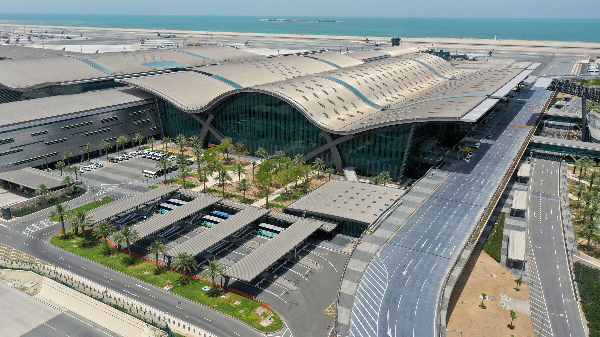

# Doha-Hamad
## Airport Overview
### Information

<figure markdown>

</figure>

| IATA | ICAO | Charts                                          | NOTAM(s)   |
|:----:|:----:|:-----------------------------------------------:|:----------:|
| DOH  | OTHH | [Qatar eAIP](https://www.aim.gov.qa/eAIP1.html) |            |

Hamad International Airport is an international airport in Qatar and serves as the main hub for the national flag carrier, Qatar Airways. Located to the east of the capital city, Doha, it has replaced the nearby Doha International Airport as Qatar's primary national airport and has become one of the busiest airports in the Middle East.

### Charts & Scenery
Pilots can access the latest charts through the following sources: [Chartfox (Free, VATSIM login required)](https://chartfox.org/), [Qatar eAIP](https://www.aim.gov.qa/eAIP1.html), or [Navigraph (Subscription required)](https://navigraph.com/).

| Simulator      | Freeware                                                                           | Payware                                                                                                                           |
|----------------|------------------------------------------------------------------------------------|-----------------------------------------------------------------------------------------------------------------------------------|
| MSFS           | [flightsim.to](https://flightsim.to/file/14639/doha-city-and-hamad-airport-v2-wip) | [MXI Design](https://orbxdirect.com/product/mxidesign-othh-msfs?srsltid=AfmBOorSUbpAdfQPk3byohWDT66taPrJvg6F9c4L9nO8NxV93QifouBE) |
| X-Plane        | X-Plane Default                                                                    |                                                                                                                                   |
| Prepar3D V4/V5 | [AVSIM](https://library.avsim.net/search.php?SearchTerm=othh&CatID=root&Go=Search) | [Taxi2Gate](https://secure.simmarket.com/taxi2gate-othh-v2-p3d5.phtml)                                                            |

### Stand Allocation
|  Apron/Concourse  |            Stand Allocation           |                     Operator                    |
|:-----------------:|:-------------------------------------:|:-----------------------------------------------:|
|    Concourse A    |            Stands A1 to A11           |           International Operators, QTR          |
|    Concourse B    |            Stands B1 to B10           |           International Operators, QTR          |
|    Concourse C    |            Stands C1 to C13           |           International Operators, QTR          |
|    Concourse D    |            Stands D1 and D3           |           International Operators, QTR          |
|    Concourse E    |            Stands E1 and E3           |           International Operators, QTR          |
| Central Concourse |           Stands 301 to 309           |                       QTR                       |
| Remote Transfer G |            Stands H1 to H10           | Low Cost Carriers, International Operators, QTR |
| Remote Transfer H |            Stands G1 to G10           | Low Cost Carriers, International Operators, QTR |
|    Cargo Apron    |            Stands F1 to F16           |              Cargo, QTR (Overflow)              |
|      Apron V      |            Stands V1 to V12           |            Government & State Aircraft          |
|      Apron 4      |           Stands 425 to 429           |                       QTR                       |
|      Apron 5      | Stands 501 to 519 & Stands 551 to 564 |                       QTR                       |
|      Apron 6      |           Stands 601 to 637           |                       QTR                       |

!!! Info
    All arriving aircraft will be assigned a stand by the stand assigner using the Ground Radar Plugin. In real-world operations, aircraft may be parked at any apron, regardless of their arrival runway assignment.

### Air Traffic Control positions
| Login Code |      Radio Callsign      | Frequency |                                                                                 Area of Responsibility                                                                                 |
|:----------:|:------------------------:|:---------:|:--------------------------------------------------------------------------------------------------------------------------------------------------------------------------------------:|
|  OTHH_DEL  | Hamad Clearance Delivery |  120.875  |                                                                                                                                                                                        |
| OTHH_1_GND |       Hamad Ground       |  120.225  | - Apron 3 (Stands 301-305) - Apron 4 - Cargo Apron - Concourse B - Concourse C (East Side) - Concourse E - Emiri Apron - Maintenance Apron - Remote Transfer G |
| OTHH_2_GND |       Hamad Ground       |  118.650  |                - Apron 3 (Stands 306-309) - Apron 5 - Concourse A - Concourse C (West Side) - Concourse D - General Aviation Apron - Remote Transfer H               |
| OTHH_3_GND |       Hamad Ground       |  118.575  |                                                                                        - Apron 6                                                                                       |
| OTHH_4_GND |       Hamad Ground       |  118.075  |                                                                                  - Overflow Frequency                                                                                  |
| OTHH_5_GND |       Hamad Ground       |  119.075  |                                                                                   - Planner Frequency                                                                                  |
| OTHH_1_TWR |        Hamad Tower       |  118.525  |                                                                                    - Runway 16L/34R                                                                                    |
| OTHH_2_TWR |        Hamad Tower       |  118.025  |                                                                                    - Runway 16R/34L                                                                                    |
| DOH_F1_APP |       Doha Director      |  119.400  |                                                                    Final Approach Sequencing, Runway 16L/34R (OTHH)                                                                    |
| DOH_F2_APP |       Doha Director      |  124.050  |                                                                    Final Approach Sequencing, Runway 16R/34L (OTHH)                                                                    |
| DOH_F3_APP |       Doha Director      |  123.875  |                                                                     Final Approach Sequencing, Runway 15/33 (OTBD)                                                                     |
| DOH_A1_APP |       Doha Approach      |  124.775  |                                                                                      Approach East                                                                                     |
| DOH_A2_APP |       Doha Approach      |  119.725  |                                                                                      Approach West                                                                                     |
| DOH_R1_APP |        Doha Radar        |  121.100  |                                                                                       Radar North                                                                                      |
| DOH_R2_APP |        Doha Radar        |  120.675  |                                                                                       Radar South                                                                                      |
| OTDF_1_CTR |       Doha Control       |  135.725  |                                                                                      Control North                                                                                     |
| OTDF_2_CTR |       Doha Control       |  132.975  |                                                                                      Control South                                                                                     |

!!! Warning
    It's crucial that you pay close attention to the frequency you're being transferred to. Do not attempt to guess the next frequency, and never switch frequencies without explicit instructions from the controller. Auto-handoffs are issued with the take-off clearance at Doha-Hamad International. If you're unsure, don’t hesitate to ask for the frequency again!
