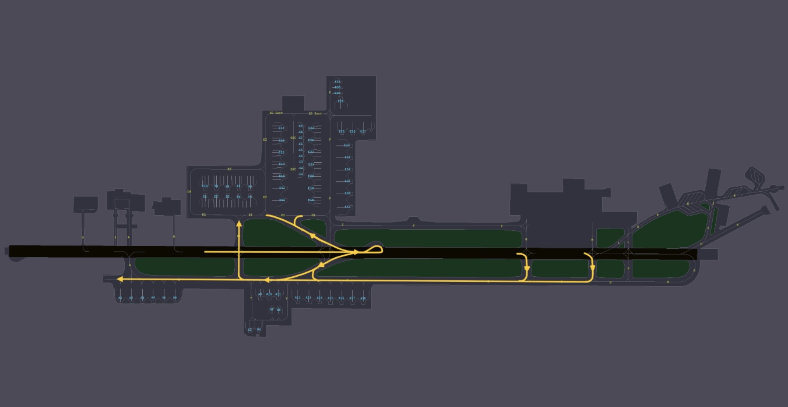

# Doha
## Arriving Traffic
### STAR Assignment
STAR assignments are based on the waypoint at which you enter the Doha Terminal Maneuvering Area (TMA). The table below outlines the possible STARs for each entry point. ATC will assign the appropriate STAR depending on traffic conditions, with a preference for the shortest available routing whenever possible.

!!! note
    It is essential to highlight that the following arrival procedures are applicable to both Doha (OTBD) and Hamad (OTHH) airports. These procedures are not airport-specific.  

    Aircraft can be sequenced on any of the STARs that guide them either to the east or west downwinds, depending on sector capacity.

#### 3.1.2.1 Doha 15 / Hamad 16s
| Procedure |        Type        | Length | Downwind |
|:---------:|:------------------:|:------:|:--------:|
|  ALKAN1F  |      Trombone      |  Long  |   West   |
|  ALKAN1H  | Direct to Downwind |  Short |   East   |
|  ALKAN1P  |      Trombone      |  Long  |   East   |
|  LAEEB1F  | Direct to Downwind |  Short |   West   |
|  LAEEB1K  |      Trombone      |  Long  |   West   |
|  ORLEK1F  |      Trombone      |  Long  |   West   |
|  TOSNA1P  | Direct to Downwind |  Short |   East   |
|  TOSNA1T  |      Trombone      |  Long  |   East   |
|  TOSNA2F  |      Trombone      |  Long  |   West   |
|  TOVOX1P  | Direct to Downwind |  Short |   East   |
|  TOVOX2F  |      Trombone      |  Long  |   West   |
|  VEDED1F  |      Trombone      |  Long  |   West   |
|  VEDED1H  | Direct to Downwind |  Short |   East   |
|  VEDED1P  |      Trombone      |  Long  |   East   |

#### 3.1.2.2 Doha 33 / Hamad 34s
| Procedure |        Type        | Length | Downwind |
|:---------:|:------------------:|:------:|:--------:|
|  ALKAN1L  |      Trombone      |  Long  |   West   |
|  ALKAN1R  |      Trombone      |  Long  |   East   |
|  ALKAN1V  | Direct to Downwind |  Short |   East   |
|  LAEEB1J  |      Trombone      |  Long  |   West   |
|  LAEEB1L  | Direct to Downwind |  Short |   West   |
|  ORNEL1L  | Direct to Downwind |  Short |   West   |
|  TOSNA1J  |      Trombone      |  Long  |   West   |
|  TOSNA1R  | Direct to Downwind |  Short |   East   |
|  TOSNA1V  |      Trombone      |  Long  |   East   |
|  TOSNA2L  |      Trombone      |  Long  |   West   |
|  TOVOX1R  | Direct to Downwind |  Short |   East   |
|  TOVOX2L  |      Trombone      |  Long  |   West   |
|  VEDED1L  |      Trombone      |  Long  |   West   |
|  VEDED1R  |      Trombone      |  Long  |   East   |
|  VEDED1V  | Direct to Downwind |  Short |   East   |

!!! warning
    All STARs into Doha include altitude and speed restrictions, which must be adhered to unless explicitly canceled by ATC. Pilots should verify clearance levels through instructions such as "**DESCEND VIA STAR**," "**DESCEND UNRESTRICTED**," or "**CANCEL STAR SPEEDS**."

### Runway Assignment
Runway assignments are issued by Doha Radar or Doha Approach and may be given with short notice during high-traffic periods. Pilots should be prepared for all arrival runways listed in the ATIS.

If the aircraft supports a secondary flight plan, pilots should preload an alternate arrival runway to facilitate a swift transition if required.

### Approach
The standard approach at Doha-Hamad is the ILS, with independent parallel operations in effect. Pilots can expect a minimum diagonal separation of 3 NM from traffic on the opposite runway and 2 NM spacing from preceding aircraft on the opposite runway.

### Speeds
The speed limits and recommended speeds within different segments of the Doha terminal area is as follows:

|  Speed Range  |              Arrival Segment              |
|:-------------:|:-----------------------------------------:|
| 230 - 210 kts |           Initial approach phase          |
|    180 kts    | Base leg/closed heading to final approach |
|    180 kts    |                Until 10 DME               |
|    160 kts    |                Until 4 DME                |

!!! note
    Aircraft subject to speed restrictions on final with DME constraints may be instructed by ATC to comply with "**STANDARD SPEEDS**" meaning pilots are expected to maintain these speeds until final approach.  

All speed restrictions must be adhered to as accurately as possible. Aircraft unable to comply with these restrictions must notify ATC in advance and specify the speeds they can maintain. Pilots should also inform ATC if circumstances require a speed adjustment for any reason.  

To ensure accurate spacing, pilots are requested to comply with speed adjustments as promptly as practicable, considering their operational constraints.  

If traffic sequencing does not require speed limitations, ATC will advise, “**NO ATC SPEED RESTRICTION**.”  

### Arrival Taxi
#### Runway 15/33 Configuration
##### Arrivals, Runway 15
<figure markdown>

</figure>

##### Arrivals, Runway 33
<figure markdown>

</figure>
