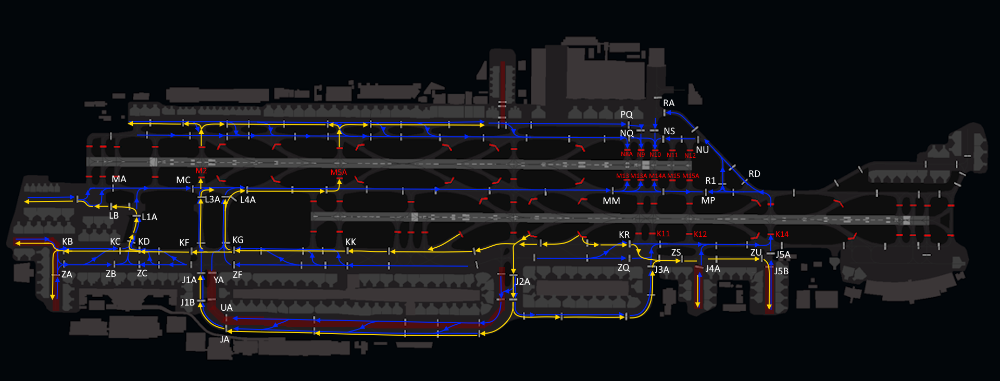
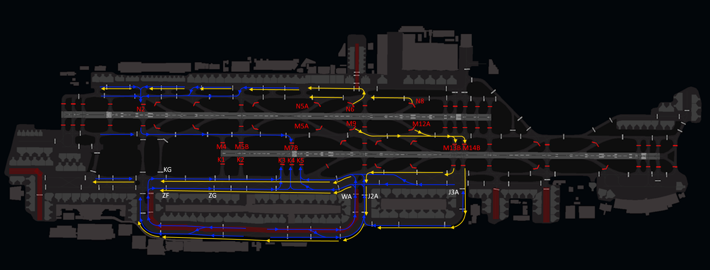
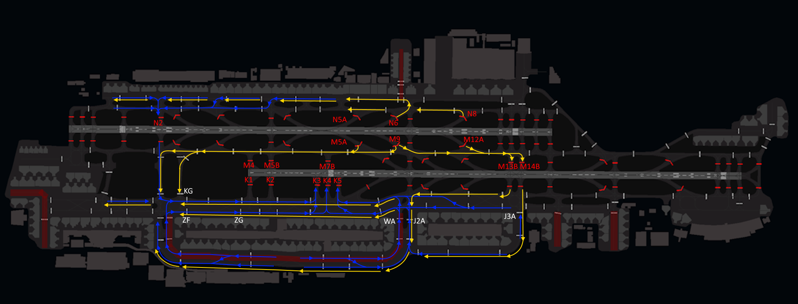

# Arriving Traffic
## STAR Assignment
STAR assignments are based on the waypoint at which you enter the Dubai Terminal Maneuvering Area (TMA). ATC will assign the appropriate STAR depending on traffic conditions and active runway.

!!! warning
    All STARs into Dubai include altitude and speed restrictions, which must be adhered to unless explicitly canceled by ATC. Pilots should verify clearance levels through instructions such as "**DESCEND VIA STAR**," "**DESCEND UNRESTRICTED**," or "**CANCEL STAR SPEEDS**."

## Runway Assignment
The arrival runway is specified in the Dubai Arrival ATIS, with a preference for 30L arrivals.

## Approach
The standard approach at Dubai is the ILS, however the expected approach can be found in the Dubai Arrival ATIS.

## Speeds
The speed limits and recommended speeds within different segments of the Dubai terminal area is as follows:

|  Speed Range  |              Arrival Segment              |
|:-------------:|:-----------------------------------------:|
| 210 - 250 kts |           Initial approach phase          |
| 180 - 230 kts |         From downwind to base leg         |
| 160 - 210 kts |                 On base leg               |
|    190 kts    |                Until 10 DME               |
|    160 kts    |                Until 4 DME                |

All speed restrictions must be adhered to as accurately as possible. Aircraft unable to comply with these restrictions must notify ATC in advance and specify the speeds they can maintain. Pilots should also inform ATC if circumstances require a speed adjustment for any reason.  

To ensure accurate spacing, pilots are requested to comply with speed adjustments as promptly as practicable, considering their operational constraints.  

If traffic sequencing does not require speed limitations, ATC will advise, “**NO ATC SPEED RESTRICTION**.”  

## Landing
### Minimum Runway Occupancy
During peak traffic periods, rapid runway vacating is essential to prevent disruption to the aerodrome traffic flow. Ensure your entire aircraft has passed the designated runway holding point before considering yourself clear. Avoid unnecessary stops before exiting completely.

All rapid exit taxiways are equipped with rapid taxiway indicator lights. Pilots are encouraged to maintain the designated exit taxi speed of 50 knots.

!!! info
    Dubai Tower will assign a runway vacate point on first contact. If pilots are unable to comply with this, they should advise ATC at the earliest opportunity.

### ILS Glidepath Fluctuations
Aircraft may experience glidepath signal fluctuations due to taxiing and departing aircraft. Pilots should be prepared for potential glidepath interference and closely monitor their ILS profile, flight display indications, and autopilot behavior during both manual and coupled ILS approaches.

## Taxi
After landing, aircraft must not stop on the rapid exit taxiways and shall continue taxiing according to the following procedures unless otherwise instructed by the tower controller:  

- **Runway 30L:** Continue via K northbound.  
- **Runway 30R:** Continue via M or N northbound.  
- **Runway 12L:** Continue via M or N northbound.
- **Runway 12R:** Continue via K northbound.

The following taxi diagrams depict the standard taxi routings. Note that it may be necessary for operational reasons to deviate from these routings and pilots should follow ATC instructions at all times.

### Runway 30s Configuration
#### General
<figure markdown>

</figure>

### Runway 12s Configuration
#### General
<figure markdown>

</figure>

#### Departure Bias
<figure markdown>

</figure>

#### Arrival Bias
<figure markdown>

</figure>

