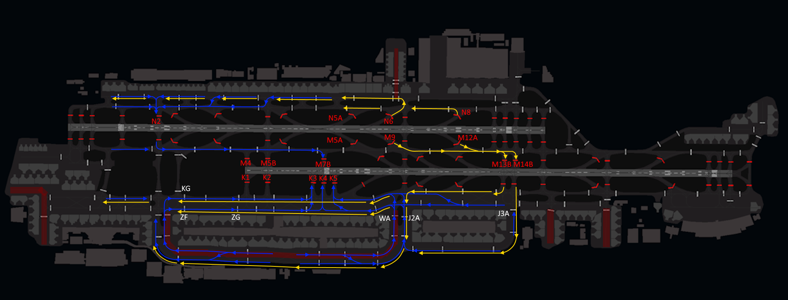

# Departing Traffic
<figure markdown>

</figure>

## Flight Planning: Route(s)
Pilots can find valid routes for most flights departing from Dubai on SimBrief by choosing the "Preferred Route" option. Our operations department updates the "Preferred Route" on SimBrief with every AIRAC cycle, ensuring compliance with Air Traffic Flow Management (ATFM) regulations in the Middle East and Eurocontrol IFPS validation.

<figure markdown>
{ width="600" }
  <figcaption>Figure 1-1: Simbrief Preferred Route</figcaption>
</figure>

<figure markdown>
{ width="600" }
  <figcaption>Figure 1-2: Simbrief Preferred Route</figcaption>
</figure>

## Flight Planning: Standard Instrument Departure (SID)
Controllers will assign a Standard Instrument Departure (SID) based on the first waypoint in your flight plan, guiding you out of the Dubai Terminal Maneuvering Area (TMA). Refer to the table below to see which SID you can expect. If your waypoint isn't listed in the table, ensure your AIRAC cycle is up to date. If your AIRAC is outdated, please inform the controller promptly so we can arrange an omnidirectional departure for you. All initial climbs are set at 4000ft!

| Waypoint |  12L/R  |  30L/R  |
|----------|:-------:|:-------:|
| ANVIX    |   5G    |   7F    |
| DAVMO    |   4G    |   4F    |
| EMERU    |   2G    |   2F    |
| IVURO    |   1G    |   1F    |
| KUTLI    |   4G    |   4F    |
| MIROT    |   3G    |   3F    |
| NABIX    |   3G    |   3F    |
| RIDAP    |   3G    |   2F    |
| SENPA    |   3G    |   2F    |

!!! Note
    Please be aware that the departures listed above apply to both the left and right runways. At Dubai International, there are no runway-specific SIDs, so your clearance will not include a designated runway. You can determine your departure runway by checking the Automatic Terminal Information Service (ATIS).

## Getting your clearance
Departing aircraft shall contact Dubai Delivery **10 minutes prior to start-up** and pass the following information:
<ul>
    <li>Aircraft Callsign</li>
    <li>Aircraft Type</li>
    <li>Parking Stand</li>
    <li>Requested Flight Level</li>
    <li>Destination</li>
    <li>Standard Instrument Departure (and departure speed if unable to comply with SID minimum speed restrictions)</li>
    <li>Current Departure ATIS Information</li>
    <li>Aircraft routing via M318 to report crossing level for GABKO if below FL150</li>
</ul>

### Datalink Clearance (DCL)
The preferred method for obtaining your clearance is through datalink. To request clearance via Hoppie datalink, send your request to **OMDB**. Please note that logging on to the station is not required. No readback is necessary.

### Voice Clearance
In Dubai, if datalink clearances are unavailable, voice clearances will be provided. These will be brief, covering only your Standard Instrument Departure (SID), initial climb, and squawk code. Ensure you have the latest departure ATIS information before proceeding.

!!! example
    **Pilot**: "Dubai Delivery, good evening, UAE1GP, Boeing 777-300ER, stand A8, requesting FL360, to Nice, NABIX3F departure, with information F on board."

    **Controller**: "UAE1GP, information F correct, cleared to Nice via the NABIX3F departure, maintain altitude 4000ft, squawk 0542."

    **Pilot**: "Cleared to Nice, NABIX3F departure, maintain altitude 4000ft, squawk 0542, UAE1GP."

    **Controller**: "UAE1GP, readback is correct, QNH 1004, report ready for push and start"

!!! warning
    Clearance delivery will not provide push and start clearance. However, remain on the clearance delivery frequency; do not switch to the ground frequency on your own. You must report fully ready on the delivery frequency—this includes having the jetway disconnected, tug connected, and chocks removed. Delivery will advise when to switch to the appropriate ground frequency, based on the current airport departure rate.

### Airport Collaborative Decision Making (A-CDM)
Dubai has implemented **A**irport **C**ollaborative **D**ecision **M**aking (**A-CDM**) procedures to ensure efficient operations and reduce time spent at the holding point. Pilots are required to adhere to assigned A-CDM times. When A-CDM procedures are in effect, this will be announced in the ATIS. Pilots should set their **T**arget **O**ff **B**lock **T**ime (**TOBT**) and update it whenever their estimate changes by more than 5 minutes using the [VATMENA vACDM Pilot Interface](https://vacdm.vatsim.me), aiding controllers in departure planning.

If you are unfamiliar with A-CDM procedures, please refer to the [A-CDM pilot guide](https://vacdm.net/docs/pilot/use-vacdm).

## Push & Start
Once clearance delivery releases you to the designated ground frequency, pilots may request push and start clearance. Upon initial contact, the ground controller may provide various types of pushback instructions. Pilots must ensure they can comply with these instructions; if unable, they must inform the ground controller.

Pushback clearances will specify a direction to face, such as West or East, and a particular taxiway to push onto.

!!! info
    The IniBuilds Dubai GSX profile (available through IniManager) includes most of the pushback clearances you can expect. If you don't have this profile installed, ensure you can follow the pushback instructions using the GSX Quick Edit option.

!!! example
    **Controller**: "UAE4CK, push and start is approved face west onto taxiway Z."

!!! warning
    If pilots are unable to commence pushback within 2-3 minutes, the pushback clearance may be revoked, and slot times will be recalculated.

## Taxi
Pilots must comply with all taxi instructions, including holds. Taxi instructions are given based on various factors such as aircraft type and traffic.

!!! info
    Controllers regularly make use of intermediate holding points to optimise traffic flow. These can be found on the **Taxi and Parking** charts.

!!! example
    **Controller**: "UAE9LT, Dubai Ground, taxi via Z, L4, hold L4A."

### Standard Intersection Departures
For the purposes of takeoff performance planning the standard departure taxiways are:

* 12R - K5
* 12L - M1C/N1C
* 30R - M13/N8A
* 30L - K15A/M18A

Crews should base their performance calculations on departure from standard departure points from the notified runway in use if there is no restriction to payload.

ATC may tactically use a different departure point nearer the runway end based on the traffic situation.

The following taxi diagrams depict the standard taxi routings. Note that it may be necessary for operational reasons to deviate from these routings and pilots should follow ATC instructions at all times.

### Runway 30s Configuration
#### General
<figure markdown>

</figure>

### Runway 12s Configuration
#### General
<figure markdown>

</figure>

#### Departure Bias
<figure markdown>

</figure>

#### Arrival Bias
<figure markdown>

</figure>

## Take-off

### Minimum Runway Occupancy
On receipt of a line-up clearance pilots shall ensure, complying with safety and standard operating procedures, that they are able to line-up on the runway as soon as the preceding aircraft has commenced take-off roll.

Wherever possible, pilots are encouraged to conduct a rolling takeoff to minimise runway occupancy time.