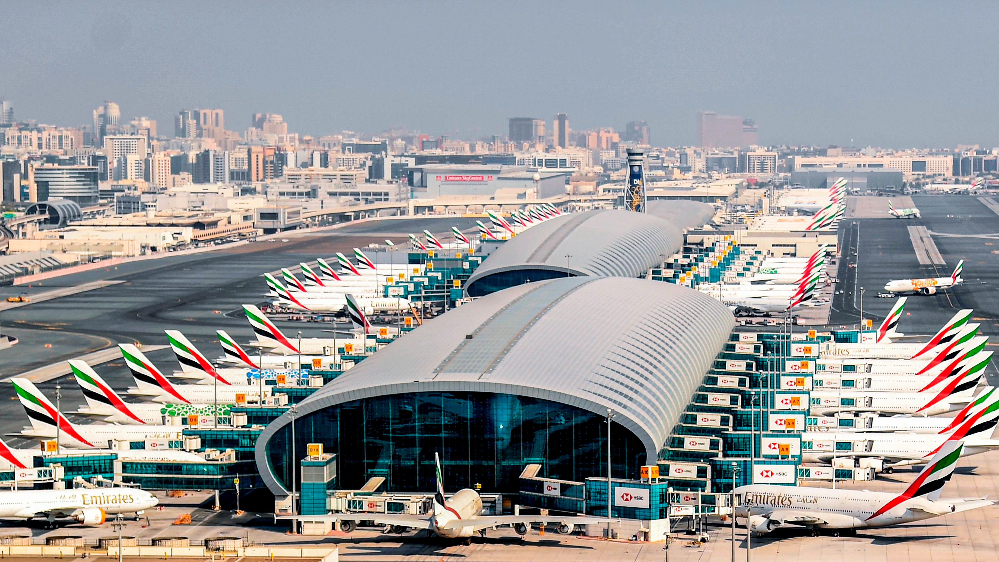

# Airport Overview
## Information

<figure markdown>

</figure>

| IATA | ICAO | Charts | NOTAM(s) |
|:----:|:----:|:------:|:----------:|
| DXB  | OMDB | [U.A.E eAIP (Account Required)](https://www.gcaa.gov.ae/en/ais/Pages/default.aspx)    | [U.A.E FIR - NOTAM(S) ](https://www.gcaa.gov.ae/en/ais/notice-to-airmen-notam)      |

Dubai International Airport is the primary gateway for Dubai and the United Arab Emirates. It ranks as the world's busiest airport by international passenger traffic and is also the largest airport in the Middle East. Globally, it is the second busiest by total passenger volume and the leading airport for Airbus A380 and Boeing 777 operations.

Located 2.54 nautical miles east of Dubai's city center in the Al Garhoud district, the airport is home to Emirates Airline and low-cost carrier FlyDubai.

!!! Tip
    Dubai International is one of the busiest globally and the most active in the Middle East. Due to the high volume of traffic during peak hours and the airport's operational complexity, **it is essential that you prepare thoroughly**, as any professional crew would. Be sure to review this brief and the corresponding charts carefully.

    **If you are new to the VATSIM Network**, we strongly recommend avoiding this airport until you have gained more experience flying on the network. During peak times, controllers are often too busy to offer additional assistance. Instead, consider flying to other airports within the Arabian vACC, where the traffic is lighter and procedures are less complex, allowing for a more accommodating experience.

## Charts & Scenery
Pilots can access the latest charts through the following sources: [Chartfox (Free, VATSIM login required)](https://chartfox.org/), [the U.A.E eAIP (Free, account required)](https://www.gcaa.gov.ae/en/ais/Pages/default.aspx), or [Navigraph (Subscription required)](https://navigraph.com/). **VFR charts in Navigraph are listed under the "APP" category with "Runway Unspecified."**

| Simulator      | Freeware                    | Payware                            |
|----------------|-----------------------------|------------------------------------|
| MSFS           | [flightsim.to](https://flightsim.to/file/35295/omdb-dubai-international-general-enhancement) | [IniBuilds](https://inibuilds.com/products/inibuilds-dubai-omdb-msfs) |
| X-Plane        | X-Plane Default             | [TAIMODELS](https://orbxdirect.com/product/taimodels-omdb-xp11-xp12?srsltid=AfmBOopPtBA3ju1rhXF6pIfYWByGIDgNMhirnOKCRLb3wASSzRvsEaeI) |
| Prepar3D V4/V5 | [AVSIM](https://library.avsim.net/search.php?SearchTerm=OMDB&CatID=fsxscen&Go=Search) | [FlyTampa](https://www.flytampa.org/omdb.html) |

!!! Warning
    The latest airport layout is reflected in MSFS, X-Plane, and the freeware Prepar3D sceneries. However, the payware Prepar3D scenery from FlyTampa features the 2012 airport layout, which lacks Concourse D and some taxiways/rapid-exits. Pilots using the FlyTampa scenery must inform the controller of this on initial contact.

## Stand Allocation

|       Area       |        Stand Allocation       |                                                      Operator                                                     |
|:----------------:|:-----------------------------:|:-----------------------------------------------------------------------------------------------------------------:|
| Concourse A      | Stands A1 to A10, D1 to D10   | ACA, QFA, UAE, UAL                                                                                                |
| Concourse B      | Stands B14 to B27, F16 to F27 | ACA, QFA, UAE, UAL                                                                                                |
| Concourse C      | Stands B1 to B12, F2 to F13   | FDB (Stands: F2, B1 to B10), UAE                                                                                  |
| Concourse D      | Stands C48 to C64             | International Operators                                                                                           |
| Apron C (Remote) | Stands C18 to C47             | UAE (Stands: C24 to C40), FDB (Stands: C18 to C23, C27 to C40), KAM (Stands: C36 to C40), International Operators |
| Apron E (Remote) | Stands E1 to E45              | AXB, FDB, other low cost and cargo operators                                                                  |
| Apron G (Remote) | Stands G1 to G22              | UAE (Overflow)                                                                                                    |
| Apron H          | Stands H1 to H4               | AUH, DUB                                                                                                          |
| Apron Q (Remote) | Stands Q1 to Q11              | FDB                                                                                                               |
| Apron S (Remote) | Stands S1 to S15              | UAE (Overflow)                                                                                                    |

!!! Info
    All arriving aircraft will be assigned stands by our stand assigner using the Ground Radar Plugin. Virtual Airlines can expect to be directed to park at Concourse D.

## Air Traffic Control positions
| Login Code |  Radio Callsign  | Frequency | Area of Responsibility                                            |
|:----------:|:----------------:|:---------:|-------------------------------------------------------------------|
| OMDB_DEL   | Dubai Delivery   | 120.350   | - All IFR & VFR Clearances                                        |
| OMDB_1_GND | Dubai Ground     | 118.350   | - Primary Ground Position - Concourse A, B, C, Apron G, Apron H   |
| OMDB_2_GND | Dubai Ground     | 121.650   | - Concourse D, Apron C, Apron E, Apron Q, Apron S                 |
| OMDB_1_TWR | Dubai Tower      | 118.750   | - Primary Tower Position - Runway 12L/30R                         |
| OMDB_2_TWR | Dubai Tower      | 119.550   | - Runway 12R/30L                                                  |
| OMDB_1_DEP | Dubai Departures | 121.025   | - Primary Departure Position                                      |
| OMDB_2_DEP | Dubai Departures | 124.675   | -                                                                 |
| OMDB_APP   | Dubai Arrivals   | 124.900   | - Primary Arrivals Position - Services for: OMDB, OMSJ, OMDW      |
| OMDB_F_APP | Dubai Director   | 127.900   | - Final approach sequencing - Call with callsign only!            |

!!! Warning
    It's crucial that you pay close attention to the frequency you're being transferred to. Do not attempt to guess the next frequency, and never switch frequencies without explicit instructions from the controller. Auto-handoffs are not used at Dubai International. If you're unsure, don’t hesitate to ask for the frequency again!

## Reduced Runway Separation Minima (RRSM)
Reduced runway separation may be implemented at any time, day or night, under the following scenarios:

- A departing aircraft followed by another aircraft departing from the same runway.
- Two consecutive landing aircraft.
- Two consecutive departing aircraft.

### Conditions for Application:

- The tailwind component does not exceed **5 knots** at the landing threshold, and there are no pilot reports of **wind shear**.
- Meteorological visibility is at least **5000 metres**, and the cloud ceiling is not below **1000 feet**. The AIR controller must be confident that the following aircraft can **continuously and completely observe** the relevant traffic.
- Traffic information is provided to the crew of the **succeeding aircraft**.
- The runway is **dry**, with no indications that braking action will be adversely affected.
- The AIR controller must be able to assess separation **visually** or using **radar-derived information**.
- Suitable **landmarks and surface surveillance markers** must be available to assist in assessing aircraft separation.
- **Wake turbulence separation minima** must be maintained.
- **Minimum separation** must still exist between two departing aircraft **immediately after** the second aircraft takes off.
- The pilot of an arriving aircraft must be informed of the **expected exit point** for runway vacating.