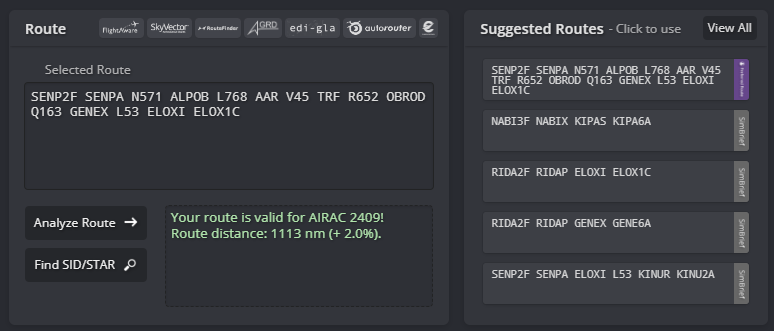

# Departing Traffic
## Flight Planning: Route(s)
Pilots can find valid routes for most flights departing from Salalh on SimBrief by choosing the "Preferred Route" option. Our operations department updates the "Preferred Route" on SimBrief with every AIRAC cycle, ensuring compliance with Air Traffic Flow Management (ATFM) regulations in the Middle East and Eurocontrol IFPS validation.

<figure markdown>
{ width="600" }
  <figcaption>Figure 1-1: Simbrief Preferred Route</figcaption>
</figure>

<figure markdown>
{ width="600" }
  <figcaption>Figure 1-2: Simbrief Preferred Route</figcaption>
</figure>

## Flight Planning: Standard Instrument Departure (SID)
Controllers will assign a Standard Instrument Departure (SID), guiding you out of the Salalah Terminal Maneuvering Area (TMA). Refer to the table below to see which SID you can expect. If your waypoint isn't listed in the table, ensure your AIRAC cycle is up to date. If your AIRAC is outdated, please inform the controller promptly so we can arrange an omnidirectional departure for you. All initial climbs are set at 10000ft.

| First Fix |       07      |   Initial Climb   |     25    |   Initial Climb   |
|:---------:|:-------------:|:-----------------:|:---------:|:-----------------:|
|   DAXAM   |    1Q/**1U**  |      10,000 ft    |     1S    |      10,000 ft    |
|   LADAR   |       1Q      |      10,000 ft    |     1S    |      10,000 ft    |
|   MUTVA   |       1Q      |      10,000 ft    |     1S    |      10,000 ft    |
|   SILTA   |       1Q      |      10,000 ft    |     1S    |      10,000 ft    |
<figure markdown>
  <figcaption>RNAV SIDs</figcaption>
</figure>

### Conventional Instrument Departures
Aircraft unable to comply with RNAV Standard Instrument Departures (SIDs) shall expect a conventional (non-RNAV) Instrument Departure procedure as an alternative.

| First Fix |       07      |   Initial Climb   |     25    |   Initial Climb   |
|:---------:|:-------------:|:-----------------:|:---------:|:-----------------:|
|   DAXAM   |    1P/**1T**  |      10,000 ft    | 1R/**1V** |      10,000 ft    |
|   LADAR   |       1P      |      10,000 ft    |     1R    |      10,000 ft    |
|   MUTVA   |       1P      |      10,000 ft    |     1R    |      10,000 ft    |
|   SILTA   |       1P      |      10,000 ft    |     1R    |      10,000 ft    |
<figure markdown>
  <figcaption>Conventional SIDs (Non-RNAV)</figcaption>
</figure

!!! warning
  Assignment of the MUTVA1P departure depends on the activation status of the OO(D)-65 danger area. The DAXAM departure offers two routing options: DAXAM1P/DAXAM1T and DAXAM1R/DAXAM1V, DAMXAM1T and DAXAM1V routes aircraft over the sea to avoid terrain. Aircraft unable to meet the required climb gradients must inform ATC during the clearance request to avoid being assigned a straight-out departure over the terrain.

## Getting your clearance
Departing aircraft shall contact Dubai Delivery **10 minutes prior to start-up** and pass the following information:
<ul>
  <li>Aircraft Callsign</li>
  <li>Aircraft Type</li>
  <li>Parking Stand</li>
  <li>Destination</li>
  <li>Current Departure ATIS Information</li>
</ul>

### Voice Clearance
In Salalah, voice clearances will be provided. These will be brief, covering only your Standard Instrument Departure (SID), initial climb, and squawk code. Ensure you have the latest departure ATIS information before proceeding.

!!! example
  **Pilot**: "Salalah Ground, QTR1131, Airbus A320, information B, stand 12, clearance to Doha-Hamad."

  **Controller**: "QTR1131, Salalah Ground, information B correct, cleared to Doha-Hamad via the DAXAM1S departure, initial climb 10,000 ft, squawk 4701."

  **Pilot**: "Cleared to Doha-Hamad via the DAXAM1S departure, initial climb 10,000 ft, squawk 4701, QTR1131."

  **Controller**: "QTR1131, readback correct, QNH 1004, report ready for pushback."

## Push & Start
Once clearance delivery releases you to the designated ground frequency, pilots may request push and start clearance. Upon initial contact, the ground controller may provide various types of pushback instructions. Pilots must ensure they can comply with these instructions; if unable, they must inform the ground controller.

Pushback clearances will specify a direction to face, such as West or East, and a particular taxiway to push onto.

!!! example
    **Controller**: "OMS106, Salalah Ground, short pushback approved, face east to finish abeam stand 13R."

!!! warning
    If pilots are unable to commence pushback within 2-3 minutes, the pushback clearance may be revoked, and slot times will be recalculated.

## Taxi
Pilots must comply with all taxi instructions, including holds. Taxi instructions are given based on various factors such as aircraft type and traffic.

!!! info
    Controllers regularly make use of intermediate holding points to optimise traffic flow. These can be found on the **Taxi and Parking** charts.

!!! example
    **Controller**: "OMA661, Muscat Ground, taxi via T, hold T1."

### Standard Intersection Departures
For the purposes of takeoff performance planning the standard departure taxiways are:

* 07 - D1/D2
* 25 - D7/D8

Crews should base their performance calculations on departure from standard departure points from the notified runway in use if there is no restriction to payload.

ATC may tactically use a different departure point nearer the runway end based on the traffic situation.