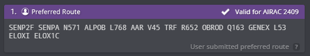

# Departing Traffic
## Flight Planning: Route(s)
Pilots can find valid routes for most flights departing from Sharjah on SimBrief by choosing the "Preferred Route" option. Our operations department updates the "Preferred Route" on SimBrief with every AIRAC cycle, ensuring compliance with Air Traffic Flow Management (ATFM) regulations in the Middle East and Eurocontrol IFPS validation.

!!! info
    Sharjah shares common SID end points with Dubai in order to manage traffic flow within the Dubai TMA

<figure markdown>
{ width="600" }
  <figcaption>Figure 1-1: Simbrief Preferred Route</figcaption>
</figure>

<figure markdown>
{ width="600" }
  <figcaption>Figure 1-2: Simbrief Preferred Route</figcaption>
</figure>

## Flight Planning: Standard Instrument Departure (SID)
Controllers will assign a Standard Instrument Departure (SID) based on the first waypoint in your flight plan, guiding you out of the Dubai Terminal Maneuvering Area (TMA). Refer to the table below to see which SID you can expect. If your waypoint isn't listed in the table, ensure your AIRAC cycle is up to date. If your AIRAC is outdated, please inform the controller promptly so we can arrange an omnidirectional departure for you. All initial climbs are set at 3000ft.

| Waypoint |   12   |   30   |
|----------|:------:|:------:|
| ANVIX    |   4Q   |   5R   |
| DAVMO    |   4Q   |   3R   |
| EMERU    |   1Q   |   1R   |
| IVURO    |   1Q   |   1R   |
| KUTLI    |   3Q   |   3R   |
| MIROT    |   3Q   |   2R   |
| NABIX    |   3Q   |   2R   |
| RIDAP    |   3Q   |   2R   |
| SENPA    |   3Q   |   2R   |

## Getting your clearance
Departing aircraft shall contact Sharjah Ground **10 minutes prior to start-up** and pass the following information:
<ul>
    <li>Aircraft Callsign</li>
    <li>Aircraft Type</li>
    <li>Parking Stand</li>
    <li>Requested Flight Level</li>
    <li>Destination</li>
    <li>Current ATIS Information and QNH</li>
</ul>

### Initial Clearance
Datalink clearances are currently unavailable at Sharjah. Clearance should be requested on the Sharjah Ground frequency. Clearances will include your Standard Instrument Departure (SID), initial climb, squawk code and airborne frequency. Ensure you have the latest ATIS information before proceeding.

!!! example
    **Pilot**: "Sharjah Ground, ABY463, Airbus A321neo, information X, stand 4, requesting IFR clearance to Delhi, FL350."

    **Controller**: "ABY463, Sharjah Ground, cleared to Delhi via DAVMO 3R, maintain altitude 3,000 ft, when airborne contact Dubai Departures on 124.675, squawk 1743."

    **Pilot**: "Cleared to Delhi via DAVMO 3R, maintain altitude 3,000 ft, when airborne contact Dubai Departures on 124.675, squawk 1743, ABY463."

    **Controller**: "ABY463, readback correct. QNH 1013, report ready for pushback."

## Push & Start
Once the pushback tug is connected, and chocks removed, pilots may request push and start clearance. The ground controller will usually provide the direction to face. Pilots must ensure they can comply with these instructions; if unable, they must inform the ground controller.

!!! example
    **Controller**: "RJA613, Sharjah Ground, pushback approved, facing east"

!!! warning
    If pilots are unable to commence pushback within 2-3 minutes, the pushback clearance may be revoked, and slot times will be recalculated.

## Taxi
Pilots must comply with all taxi instructions, including holds. Taxi instructions are given based on various factors such as aircraft type and traffic. Taxi should be expected via the next available linking taxiway to taxiway A, then direct to the appropriate holding point. This may differ based on operational requirements.

!!! example
    **Controller**: "ABY436, Taxi via A, A20, holding point B20, Runway 30."

### Standard Intersection Departures
For the purposes of takeoff performance planning the standard departure taxiways are:

* 12 - B2
* 30 - B20

Crews should base their performance calculations on departure from standard departure points from the notified runway in use.

### Runway 30 Configuration
#### General
<figure markdown>
</figure>

### Runway 12 Configuration
#### General
<figure markdown>
</figure>

## Take-off
### Minimum Runway Occupancy
On receipt of a line-up clearance pilots shall ensure, complying with safety and standard operating procedures, that they are able to line-up on the runway as soon as the preceding aircraft has commenced take-off roll or landing run.

Wherever possible, pilots are encouraged to conduct a rolling takeoff to minimise runway occupancy time.