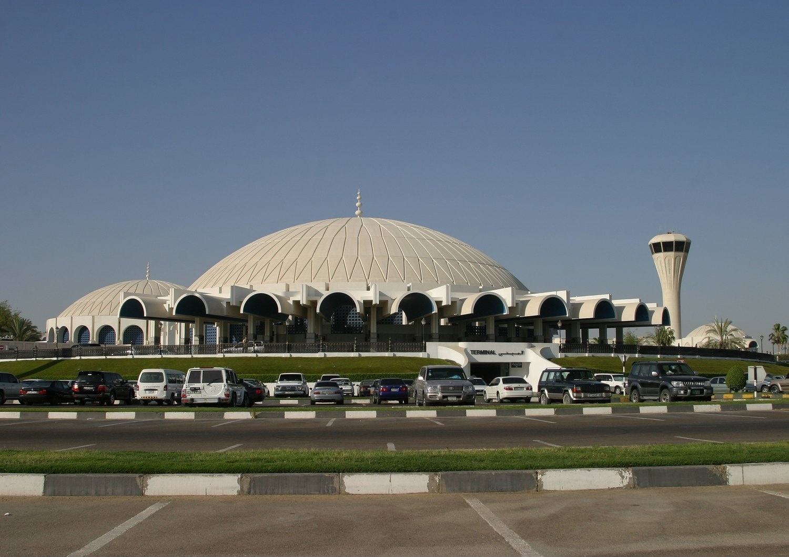

# Airport Overview
## Information

<figure markdown>

</figure>

| IATA | ICAO |                                       Charts                                       |                                    NOTAM(s)                                    |
|:----:|:----:|:----------------------------------------------------------------------------------:|:------------------------------------------------------------------------------:|
|  SHJ | OMSJ | [U.A.E eAIP (Account Required)](https://www.gcaa.gov.ae/en/ais/Pages/default.aspx) | [U.A.E FIR - NOTAM(S) ](https://www.gcaa.gov.ae/en/ais/notice-to-airmen-notam) |

Sharjah International Airport is an international airport located 7 nautical miles southeast of Sharjah, United Arab Emirates. It has a single runway and, as of 2022, is the only airport in Sharjah handling international flights.

## Charts & Scenery
Pilots can access the latest charts through the following sources: [Chartfox (Free, VATSIM login required)](https://chartfox.org/), [the U.A.E eAIP (Free, account required)](https://www.gcaa.gov.ae/en/ais/Pages/default.aspx), or [Navigraph (Subscription required)](https://navigraph.com/).

|    Simulator   |                                        Freeware                                       |                                                                    Payware                                                                   |
|:--------------:|:-------------------------------------------------------------------------------------:|:--------------------------------------------------------------------------------------------------------------------------------------------:|
|      MSFS      |                                                                                       | [MSK Productions](https://orbxdirect.com/product/msk-productions-omsj-msfs?srsltid=AfmBOooBAXPFiM5O199sxM-b0BHi7h-X6agzKrOW8dtCPlAyoDKJNslu) |
|     X-Plane    |                                    X-Plane Default                                    |                                                                                                                                              |
| Prepar3D V4/V5 | [AVSIM](https://library.avsim.net/search.php?SearchTerm=OMSJ&CatID=fsxscen&Go=Search) |                    [MSK Productions](https://secure.simmarket.com/msk-productions-sharjah-international-omsj-p3d45.phtml)                    |

## Stand Allocation
|            Area            |                Operator               |
|:--------------------------:|:-------------------------------------:|
|        1A, 1B and 1C       |                  ABY                  |
|           2 to 8           |         ABY, all international        |
|          11 to 26          |        ABY, low-cost (overflow)       |
|   51, 53, 55, 57, 59, 61   |           ABY, SQC, GEC, UPS          |
| 50, 52, 54, 56, 58, 60, 62 | ABY, other cargo, low-cost (overflow) |

!!! Info
    All arriving aircraft will be assigned stands by our stand assigner using the Ground Radar Plugin.

## Air Traffic Control positions

| Login Code |  Radio Callsign  | Frequency | Area of Responsibility                                            |
|:----------:|:----------------:|:---------:|-------------------------------------------------------------------|
| OMSJ_GND   | Sharjah Ground   | 121.875   | - All clearances and ground contact                               |
| OMSJ_TWR   | Sharjah Tower    | 118.600   | - Primary Tower Position                                          |
| OMDB_1_DEP | Dubai Departures | 121.025   | - Primary Departure Position                                      |
| OMDB_2_DEP | Dubai Departures | 124.675   | -                                                                 |
| OMDB_APP   | Dubai Arrivals   | 124.900   | - Primary Arrivals Position - Services for: OMDB, OMSJ, OMDW      |

!!! info
    For IFR flights, the airborne frequency will be provided during the IFR clearance. Pilots should note this and tune the correct Departure frequency once airborne. **Sharjah Tower will not provide a handoff.**
