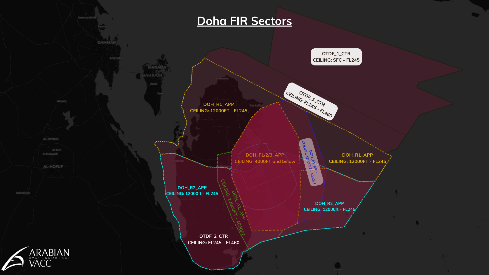

# 3. Areas of Responsibility
## 3.1 General
### 3.1.1 Concept
The Doha TMA Areas of Responsibility (AoR) are designed to minimise the need for coordination between sectors when climbing and descending traffic. This reduces controller workload, and allows a predictable flow of traffic through a complex network of SIDs and STARs.

These AoRs must be adhered to in order to prevent possible loss of separation between traffic.

For easy identification, each AoR is represented by lined and coloured areas and shades of burgandy that are different intensities. The different shades represent different vertical extents of each AoR and thus mean that each sector will have a minimum or maximum altitude that traffic may be cleared to.  However, for clarity, each AoR has also been given an alphanumeric identifier which will be used to define their vertical extents hereunder and the specific transfer procedures which are detailed in section 4. 

Although this may initially seem complex, the use of visual AoRs to represent climb and descent limits is far more intuitive and versatile than other methods.

### 3.1.2 Level clearances
Where traffic is to be given a climb or descent to the vertical boundary of an AoR, the descent clearance shall be 500 ft offset from the AoR boundary.

For example, if the AoR boundary is 7500 ft, a descent clearance may only be given to a minimum altitude of 8000 ft. Similarly, climbing traffic reaching the same AoR boundary may only be given a maximum altitude of 7000 ft.

Clearances per the AoRs will facilitate compliance with published level restrictions on SIDs and STARs.

### 3.1.3 Transfer of control
Where aircraft cross between adjacent AoRs, transfer of control shall be made to the respective controller in accordance with the transfer procedures given in section 4.

## 3.2 AoR Sectors 
Refer to Figure 3-1 for pictoral overview of Areas of Responsibility.

### 3.2.1 Sectors - Doha TMA
|    Logon   |       Sector       |  Radio Callsign |                   Area of Responsibility                  |
|:----------:|:------------------:|:---------------:|:---------------------------------------------------------:|
| DOH_R1_APP |    Radar (North)   |   "DOHA RADAR"  | Departure services for: ALSEM, ALVEN, LUBET, TULUB, VAXIN |
| DOH_R2_APP |    Radar (South)   |   "DOHA RADAR"  |     Departure Services for: BUNDU, DATRI, KUPRO, ULIKA    |
| DOH_A1_APP |   Approach (East)  | "DOHA APPROACH" |           Departures/Arrivals for runway 16L/34R          |
| DOH_A2_APP |   Approach (West)  | "DOHA APPROACH" |      Departures/Arrivals for runways 16R/34L & 15/33      |
| DOH_F1_APP |   Director (East)  | "DOHA DIRECTOR" |        Final approach sequencing for runway 16L/34R       |
| DOH_F2_APP | Director (Central) | "DOHA DIRECTOR" |        Final approach sequencing for runway 16R/34L       |
| DOH_F3_APP |   Director (West)  | "DOHA DIRECTOR" |         Final approach sequencing for runway 15/33        |
<figure markdown>
  <figcaption>Table 3-1: Doha TMA areas of responsibility</figcaption>
</figure>

<figure markdown>

</figure>
<figure markdown>
  <figcaption>Figure 3-1: Doha FIR - Sectors</figcaption>
</figure>