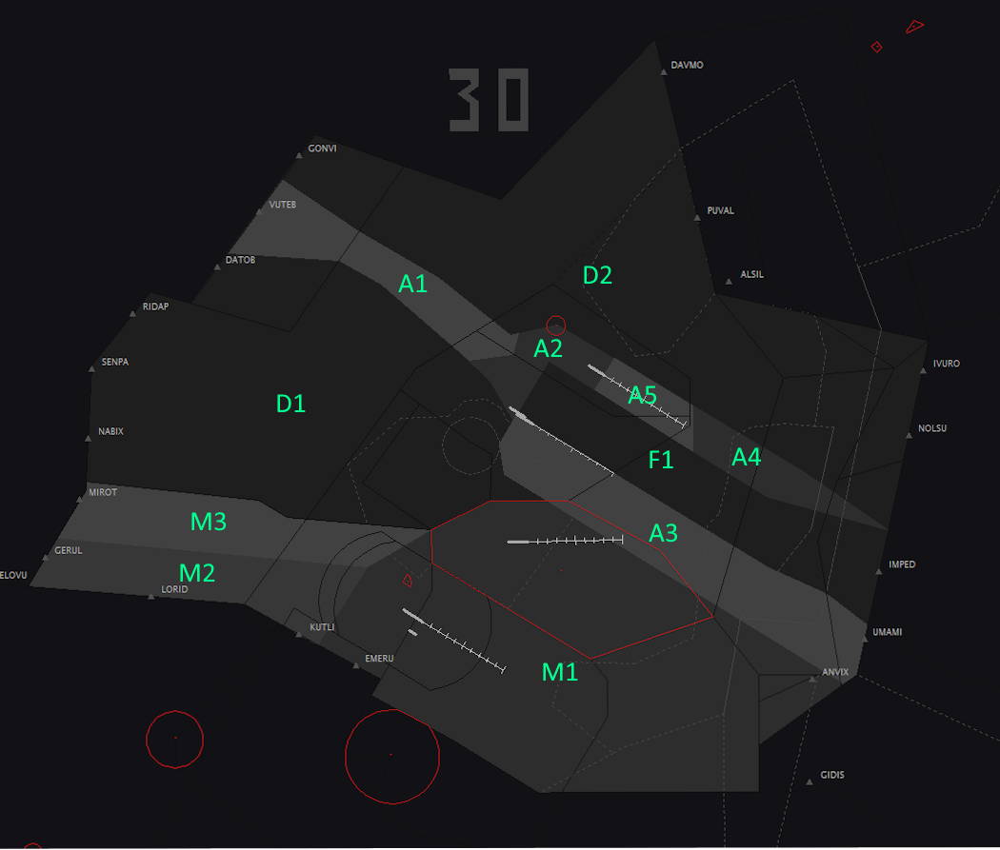
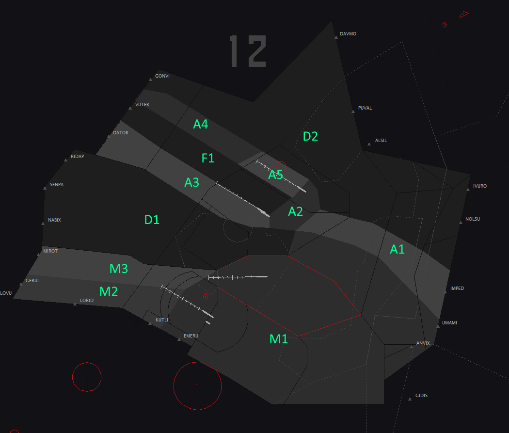

# 3. Areas of Responsibility
## 3.1 General
### 3.1.1 Concept
The Dubai CTA Areas of Responsibility (AoR) are designed to minimise the need for coordination between sectors when climbing and descending traffic. This reduces controller workload, and allows a predictable flow of traffic through a complex network of SIDs and STARs.

These AoRs must be adhered to in order to prevent possible loss of separation between traffic.

### 3.1.2 Level clearances
Where traffic is to be given a climb or descent to the vertical boundary of an AoR, the descent clearance shall be 500 ft offset from the AoR boundary.

For example, if the AoR boundary is 7500 ft, a descent clearance may only be given to a minimum altitude of 8000 ft. Similarly, climbing traffic reaching the same AoR boundary may only be given a maximum altitude of 7000 ft.

Clearances per the AoRs will facilitate compliance with published level restrictions.

### 3.1.3 Transfer of control
Where aircraft cross between adjacent AoRs, transfer of control shall be made to the respective controller in accordance with the transfer procedures given in section 4.

## 3.2 AoR Sectors - Dubai CTA 30 operation
Refer to Figure 3-1 for pictoral overview of Areas of Responsibility.

| Login                |       Sector       |     Radio Callsign   | Area of Responsibility   |
|----------------------|--------------------|----------------------|--------------------------|
| OMDB_1_DEP      | Departures (South)      | "DUBAI DEPARTURES"   | Area **D1 from 1500 ft to FL155** (excluding Jumeirah MBZ) Area **M2 from 11500 ft to FL155** Area **M3 from 10500 ft to FL155**|
| OMDB_2_DEP      | Departures (North)      | "DUBAI DEPARTURES" | Area **D2 from 1500 ft to FL155** Area **A1 from 1500 ft to 7500 ft** and **from 11500 ft to FL155** Area **A2 from 1500 ft to 5500 ft** and **from 11500 ft to FL155** Area **A4 from 1500 ft to 5500 ft** and **from 11500 ft to FL155** Area **A5 from 1500 ft to 3500 ft** and **from 10500 ft to FL155**|
| OMDB_APP        | Arrivals                | "DUBAI ARRIVALS" | Area **F1 from 1500 ft to FL155** (Lower limit shall be 6500 ft when Director online) Area **A1 from 7500 ft to 11500 ft** Area **A2 from 5500 ft to 11500 ft** Area **A3 from 1500 ft to 8500 ft** Area **A4 from 5500 ft to 11500 ft** Area **A5 from 3500 ft to 10500 ft**|
| OMDB_F_APP      | Arrvials Director       | "DUBAI DIRECTOR" | Area **F1 from 1500 ft to 6500 ft** |
| OMDW_APP        | Al Maktoum Radar        | "AL MAKTOUM RADAR" | Area **M1 from 1500 ft to FL155** Area **M2 from 1500 ft to 11500 ft** Area **M3 from 1500 ft to 10500ft** Area **A3 from 8500 ft to FL155** |
<figure markdown>

</figure>
<figure markdown>
  <figcaption>Figure 3-1: Dubai CTA 30 Config Areas of Responsibility</figcaption>
</figure>

## 3.3 AoR Sectors - Dubai CTA 12 operation
Refer to Figure 3-2 for pictoral overview of Areas of Responsibility.

| Login                |       Sector       |     Radio Callsign   | Area of Responsibility   |
|----------------------|--------------------|----------------------|--------------------------|
| OMDB_1_DEP      | Departures (South)      | "DUBAI DEPARTURES"   | Area **D1 from 1500 ft to FL155** (excluding Jumeirah MBZ) Area **M2 from 11500 ft to FL155** Area **M3 from 10500 ft to FL155**|
| OMDB_2_DEP      | Departures (North)      | "DUBAI DEPARTURES" | Area **D2 from 1500 ft to FL155** Area **A1 from 1500 ft to 7500 ft** and **from 11500 ft to FL155** Area **A2 from 1500 ft to 5500 ft** and **from 11500 ft to FL155** Area **A4 from 1500 ft to 5500 ft** and **from 11500 ft to FL155** Area **A5 from 1500 ft to 3500 ft** and **from 8500 ft to FL155** Area **F1 from 10500 ft to FL155**|
| OMDB_APP        | Arrivals                | "DUBAI ARRIVALS" | Area **F1 from 1500 ft to 10500 ft** (Lower limit shall be 6500 ft when Director online) Area **A1 from 7500 ft to 11500 ft** Area **A2 from 5500 ft to 11500 ft** Area **A3 from 1500 ft to 8500 ft** Area **A4 from 5500 ft to 11500 ft** Area **A5 from 3500 ft to 8500 ft**|
| OMDB_F_APP      | Arrvials Director       | "DUBAI DIRECTOR" | Area **F1 from 1500 ft to 6500 ft** |
| OMDW_APP        | Al Maktoum Radar        | "AL MAKTOUM RADAR" | Area **M1 from 1500 ft to FL155** Area **M2 from 1500 ft to 11500 ft** Area **M3 from 1500 ft to 10500ft** Area **A3 from 8500 ft to FL155** |

<figure markdown>

</figure>
<figure markdown>
  <figcaption>Figure 3-2: Dubai CTA 12 Config Areas of Responsibility</figcaption>
</figure>